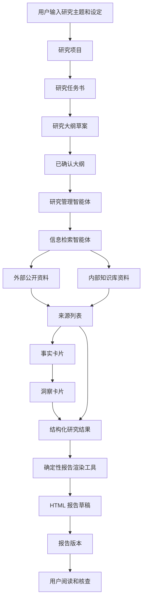
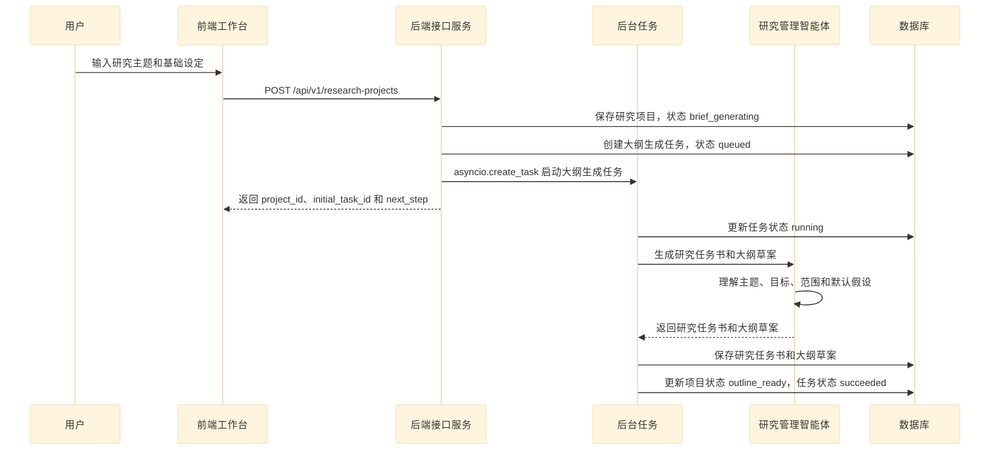
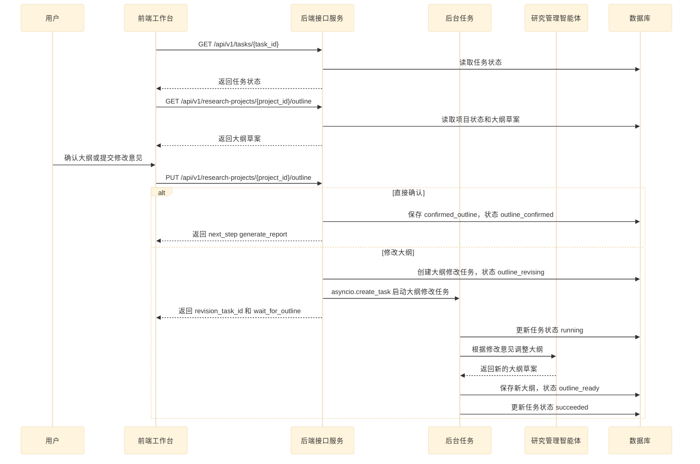
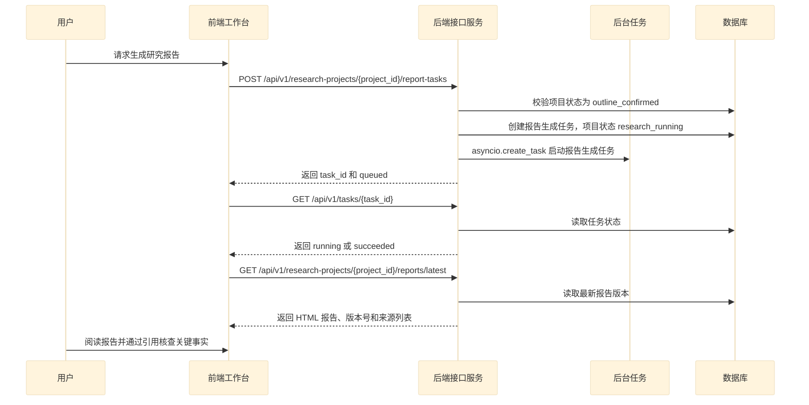
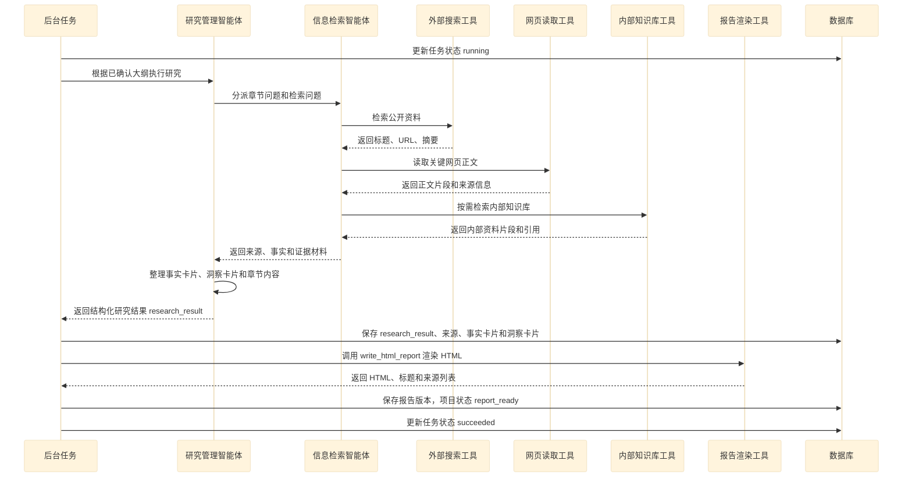
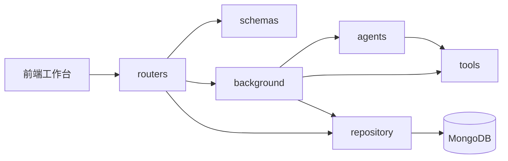

# 项目概述及骨架代码开发

## 1. 项目概述

### 1.1 项目概述及价值

本项目是一个深度研究报告平台。用户输入研究主题、研究目标、目标读者、地域范围和时间范围后，系统会围绕这个研究问题生成研究任务书和研究大纲；用户确认大纲后，系统再执行资料检索、事实整理、洞察生成和报告渲染，最终产出一份可追溯的 HTML 研究报告。

这个系统不是普通的 chatbot。普通 chatbot 主要围绕“对话”展开：用户问一句，模型答一句，系统重点维护的是上下文消息。

深度研究报告平台主要围绕“研究项目”展开：系统要维护项目状态、任务状态、大纲、来源、事实、洞察和报告版本。它不是只给出一次回答，而是把一个模糊研究问题推进成一个可核查、可保存、可继续扩展的研究产物。

两类系统的区别如下：

| 对比项   | 普通 chatbot  | 深度研究报告平台               |
| ----- | ----------- | ---------------------- |
| 核心对象  | 对话消息        | 研究项目                   |
| 用户输入  | 即时问题        | 研究主题和研究设定              |
| 系统过程  | 直接生成回答      | 生成大纲、确认大纲、执行研究、生成报告    |
| 状态管理  | 对话历史        | 项目状态、任务状态、报告版本         |
| 信息来源  | 模型知识或临时检索结果 | 外部公开资料、内部知识库           |
| 输出结果  | 一段回答        | HTML 报告、事实卡片、洞察卡片、引用来源 |
| 可靠性要求 | 用户自行判断      | 结论需要能追溯到来源             |

在传统研究过程中，以下环节通常会消耗大量时间： 

1. 基于研究问题确定报告范围和研究大纲。

2. 围绕每个章节检索资料、阅读网页和报告。

3. 从资料中提取事实，并记录事实来源。

4. 基于事实链条构建判断和洞察。

5. 将章节内容组织成完整报告。

6. 整理引用、来源和报告展示形式。

本项目的核心价值，是把这些环节拆成一条清晰的系统链路：

```text
研究问题
  -> 研究项目
  -> 研究任务书
  -> 研究大纲
  -> 资料检索
  -> 事实卡片
  -> 洞察卡片
  -> 结构化研究结果
  -> HTML 报告
```

第一版系统边界如下：

| 范围       | 第一版实现                                       | 第一版暂不实现            |
| -------- | ------------------------------------------- | ------------------ |
| 用户流程     | 创建项目、生成大纲、确认大纲、生成报告、查看报告                    | 登录、权限、团队协作         |
| 后端能力     | FastAPI 接口、Pydantic Schema、后台任务、MongoDB 持久化 | 复杂微服务拆分            |
| Agent 能力 | 研究管理智能体、信息检索智能体                             | 独立报告写作 Agent       |
| 工具能力     | 外部搜索、网页读取、RAGFlow 检索、HTML 报告渲染              | 文件上传、PDF 导出、复杂数据看板 |
| 报告生成     | 结构化研究结果 + 确定性 HTML 渲染                       | 让 LLM 自由生成整份 HTML  |

这里有一个关键取舍：LLM 负责理解问题、拆解问题、整理事实和形成洞察；确定性代码负责接口、状态、数据保存和报告渲染。这样系统既能利用 LLM 的语言和归纳能力，又能让核心业务流程保持可控。

具体启动命令为：

```bash
uv run uvicorn app.main:app --host 0.0.0.0 --port 8000 --reload --env-file .env
```

### 1.2 项目主流程

**深度研究**这个场景下，核心难点不是简单调用一次 LLM，而是要明确哪些环节交给 LLM，哪些环节交给代码，哪些环节需要人工确认。

主要问题包括：

1. LLM 的能力应该在什么地方使用？

2. 如何确保 LLM 输出的内容可以被保存和复用？

3. 如何让报告中的关键结论能够追溯到来源？

4. 哪些环节需要用户确认，避免系统沿着错误方向继续执行？

5. 哪些环节不需要 LLM，应该用确定性逻辑完成？

基于这些问题，深度研究流程可以拆成如下过程：



各个环节所做的事情：

- 创建项目：系统接收用户提交的研究主题和基础设定，生成研究项目，并保存项目初始状态。

- 生成研究任务书和大纲：研究管理智能体理解研究目标、范围和读者，生成研究任务书和大纲草案。

- 确认大纲：用户确认大纲，或者提交修改意见。只有大纲确认后，系统才进入正式研究阶段。

- 执行研究：研究管理智能体根据已确认大纲拆解章节问题，并调用信息检索智能体收集资料。

- 构建证据：信息检索智能体通过外部搜索、网页读取和内部知识库检索获得资料，整理来源和事实。

- 形成洞察：研究管理智能体基于事实卡片形成洞察卡片和结构化研究结果。

- 生成报告：系统从结构化研究结果中读取内容，使用确定性报告渲染工具生成 HTML 报告。

- 核查报告：报告保留来源列表，关键事实可以通过引用回溯到来源。

## 2. 骨架开发

### 2.1 系统调用时序图

基于前面的业务流程，可以将系统调用过程拆成几个阶段：

1. 创建研究项目，自动启动研究任务书和大纲生成任务。

2. 查询大纲并确认大纲，确定正式研究边界。

3. 提交报告生成任务，并在任务完成后读取最新报告。

4. 后台执行研究、检索资料并渲染报告。

如果把完整流程画在同一张时序图里，参与者会横向铺得很开，课件渲染时整张图会被压缩，导致文字偏小。这里按业务阶段拆成四张图，每张图只保留当前阶段真正参与的对象。

#### 2.1.1 创建项目并生成大纲



这一阶段的关键点是：接口请求很快返回，真正耗时的大纲生成放到后台任务里执行。

#### 2.1.2 查询并确认大纲



这一阶段的关键点是：用户确认大纲后，系统才进入正式研究；如果用户修改大纲，则重新进入后台修订流程。

#### 2.1.3 提交报告任务并读取结果



这一阶段的关键点是：前端只负责提交任务、轮询状态和读取结果，不直接等待长时间研究流程结束。

#### 2.1.4 后台执行研究并渲染报告



这条链路中，HTTP 接口只负责接收请求、创建任务、返回状态和读取结果。真正耗时的 LLM 调用、搜索、网页读取、知识库检索和报告渲染，都放在后台任务中执行。

### 2.2 后端模块划分

本项目后端可以划分为如下模块：

| 模块           | 作用                                          | 典型文件                               |
| ------------ | ------------------------------------------- | ---------------------------------- |
| `main`       | 创建 FastAPI 应用，注册路由，提供健康检查和静态文件挂载            | `app/main.py`                      |
| `routers`    | 定义 HTTP 接口，处理请求校验、状态判断、任务创建和结果返回            | `app/routers/__init__.py`          |
| `schemas`    | 定义请求结构、响应结构、枚举状态和核心数据模型                     | `app/schemas/__init__.py`          |
| `config`     | 管理系统配置，例如 API 前缀、模型配置、MongoDB 地址、RAGFlow 地址 | `app/config/config.py`             |
| `background` | 管理进程内后台任务，封装 `asyncio.create_task`，执行长耗时流程  | `app/background/research_tasks.py` |
| `agents`     | 构建研究管理智能体和信息检索智能体，生成大纲和结构化研究结果              | `app/agents/research_agent.py`     |
| `tools`      | 提供外部搜索、网页读取、RAGFlow 检索和报告渲染等工具能力            | `app/tools/*.py`                   |
| `repository` | 封装 MongoDB 读写，保存项目、任务、研究结果和报告版本             | `app/repository/*.py`              |

模块之间的调用关系如下：



各模块的边界如下：

- `routers` 是系统入口，负责把 HTTP 请求转成业务动作，但不直接执行长耗时研究任务。

- `schemas` 是接口契约或者其他数据模型，负责让输入输出保持结构化。

- `background` 是长任务入口，负责启动和执行大纲生成、报告生成、报告渲染等流程。

- `agents` 负责智能体逻辑，包括理解研究目标、生成大纲、协调信息检索和输出结构化研究结果。

- `tools` 负责外部能力接入，所有工具都应该有清晰的输入和输出。

- `repository` 是数据库边界，路由、后台任务和 Agent 不直接拼数据库操作细节。

### 2.3 接口设计

定义接口，本质上是定义系统如何和外界交互。接口需要同时回答三个问题：

1. 前端需要提交什么数据？

2. 后端会返回什么结构？

3. 当前操作会改变哪些项目状态或任务状态？

本项目所包含的核心接口如下：

| 接口                                                      | 方法     | 用途                       |
| ------------------------------------------------------- | ------ | ------------------------ |
| `/health`                                               | `GET`  | 服务健康检查                   |
| `/api/v1/research-projects`                             | `POST` | 创建研究项目，并自动提交研究任务书和大纲生成任务 |
| `/api/v1/research-projects/{project_id}/outline`        | `GET`  | 获取大纲草案                   |
| `/api/v1/research-projects/{project_id}/outline`        | `PUT`  | 确认大纲或提交大纲修改意见            |
| `/api/v1/research-projects/{project_id}/report-tasks`   | `POST` | 提交报告生成任务                 |
| `/api/v1/tasks/{task_id}`                               | `GET`  | 查询后台任务状态                 |
| `/api/v1/research-projects/{project_id}/reports/latest` | `GET`  | 获取最新报告                   |

项目状态和任务状态是两个不同概念：

| 类型   | 示例                                                                                       | 含义                 |
| ---- | ---------------------------------------------------------------------------------------- | ------------------ |
| 项目状态 | `brief_generating`、`outline_ready`、`outline_confirmed`、`research_running`、`report_ready` | 表示一个研究项目当前走到哪个业务阶段 |
| 任务状态 | `queued`、`running`、`succeeded`、`failed`                                                  | 表示某个后台任务当前是否执行完成   |

#### 2.3.1 创建研究项目

##### 请求

```http
POST /api/v1/research-projects
```

```json
{
  "topic": "研究具身智能行业未来三年的机会",
  "research_goal": "判断公司是否需要关注该行业",
  "target_audience": "公司战略团队",
  "region_scope": "china",
  "time_scope": {
    "type": "recent_years",
    "years": 3
  }
}
```

字段说明：

- `topic`：研究主题。

- `research_goal`：研究目标，用于约束报告最终回答什么问题。

- `target_audience`：目标读者，用于影响报告的表达方式和信息粒度。

- `region_scope`：地域范围，支持 `china`、`overseas`、`global`。

- `time_scope.type`：时间范围类型，支持 `recent_years`、`unlimited`。

- `time_scope.years`：当 `time_scope.type` 为 `recent_years` 时使用，表示近 N 年。

##### 响应

```json
{
  "project_id": "项目编号",
  "initial_task_id": "任务编号",
  "initial_task_type": "generate_research_brief",
  "topic": "研究具身智能行业未来三年的机会",
  "status": "brief_generating",
  "next_step": "wait_for_outline",
  "created_at": "2026-06-05T08:00:00Z"
}
```

说明：

- 创建研究项目后，后端自动创建大纲生成任务。

- 前端不需要再调用单独的大纲生成接口。

- `project_id` 贯穿整个研究生命周期。

- `initial_task_id` 用于查询“研究任务书和大纲草案生成任务”的状态。

- 大纲生成完成后，项目状态变为 `outline_ready`。

#### 2.3.2. 获取大纲草案

##### 请求

```http
GET /api/v1/research-projects/{project_id}/outline
```

##### 响应

```json
{
  "project_id": "项目编号",
  "status": "outline_ready",
  "outline": [
    {
      "node_id": "1",
      "title": "行业定义和研究边界",
      "question": "本报告讨论的具身智能具体指什么",
      "description": "明确行业定义、研究对象和本报告不覆盖的边界",
      "children": [
        {
          "node_id": "1.1",
          "title": "行业定义",
          "question": "具身智能和传统机器人、通用人工智能有什么区别",
          "description": "说明核心概念、技术边界和典型应用形态",
          "children": []
        },
        {
          "node_id": "1.2",
          "title": "研究范围",
          "question": "本报告覆盖哪些地区、时间范围和应用场景",
          "description": "说明本次研究的地域范围、时间范围和场景边界",
          "children": []
        }
      ]
    },
    {
      "node_id": "2",
      "title": "市场规模和增长驱动",
      "question": "行业未来三年是否存在足够大的增长空间",
      "description": "分析市场规模、增速、核心驱动因素和不确定性",
      "children": []
    }
  ]
}
```

字段说明：

- `node_id`：大纲节点 ID，用于前端展开、定位和后续编辑。

- `title`：章节标题。

- `question`：该章节需要回答的核心问题。

- `description`：该章节的写作说明。

- `children`：子章节，支持多级嵌套。

#### 2.3.3. 保存已确认大纲

##### 请求

```http
PUT /api/v1/research-projects/{project_id}/outline
```

用户可以直接确认大纲，也可以用自然语言要求系统修改大纲。

直接确认大纲：

```json
{
  "action": "confirm"
}
```

要求系统修改大纲：

```json
{
  "action": "revise",
  "revision_instruction": "把竞争格局单独拆成一章，并增加头部公司的产品对比"
}
```

##### 响应

直接确认大纲时：

```json
{
  "project_id": "项目编号",
  "status": "outline_confirmed",
  "next_step": "generate_report"
}
```

要求系统修改大纲时：

```json
{
  "project_id": "项目编号",
  "revision_task_id": "任务编号",
  "status": "outline_revising",
  "next_step": "wait_for_outline"
}
```

说明：

- `action=confirm` 表示用户不修改大纲，直接确认，项目状态变为 `outline_confirmed`。

- `action=revise` 表示用户用自然语言要求系统调整大纲，后端启动大纲修改任务，项目状态变为 `outline_revising`。

- 大纲修改完成后，项目状态重新变为 `outline_ready`。

- 前端继续调用 `GET /api/v1/research-projects/{project_id}/outline` 获取最新大纲。

#### 2.3.4. 提交报告生成任务

##### 请求

```http
POST /api/v1/research-projects/{project_id}/report-tasks
```

```json
{
  "user_instruction": "报告风格偏管理层汇报，结论要明确"
}
```

##### 响应

```json
{
  "task_id": "任务编号",
  "project_id": "项目编号",
  "task_type": "generate_report",
  "status": "queued"
}
```

说明：

- 只有项目状态为 `outline_confirmed` 时，才能提交报告生成任务。

- 提交成功后，项目状态变为 `research_running`。

- 报告生成任务内部包含研究执行和报告渲染两个阶段。

#### 2.3.5. 查询任务状态

##### 请求

```http
GET /api/v1/tasks/{task_id}
```

##### 响应

```json
{
  "task_id": "任务编号",
  "project_id": "项目编号",
  "task_type": "generate_report",
  "status": "running",
  "message": "正在检索公开资料",
  "created_at": "2026-06-05T08:00:00Z",
  "updated_at": "2026-06-05T08:03:00Z"
}
```

任务状态接口用于支持前端轮询。HTTP 请求不会一直阻塞等待后台研究完成，前端通过 `task_id` 查询任务进度。

#### 2.3.6. 获取最新报告

##### 请求

```http
GET /api/v1/research-projects/{project_id}/reports/latest
```

##### 响应

```json
{
  "project_id": "项目编号",
  "report_id": "报告编号",
  "version": 1,
  "title": "具身智能行业机会研究报告",
  "html": "<html>报告正文</html>",
  "sources": [
    {
      "source_id": "S1",
      "title": "来源标题",
      "url": "https://example.com/report",
      "published_at": "2026-01-01",
      "source_type": "public_web"
    }
  ],
  "created_at": "2026-06-05T08:30:00Z"
}
```

说明：

- `html` 是已经渲染好的报告正文。

- `sources` 是报告引用的来源列表。

- `version` 用于表示报告版本，后续可以支持重新渲染或多版本对比。

### 2.4 编码

基于前面的接口设计，骨架代码可以按下面的顺序构建：

1. 在 `schemas` 模块下定义接口出入参和状态枚举。

2. 在 `routers` 模块下定义接口路由函数。

3. 在 `config` 模块下集中管理系统配置。

4. 在 `main.py` 中创建 FastAPI 应用并注册路由。

第一阶段的代码重点是先把系统入口和接口契约搭起来。此时 Agent、MongoDB 和报告渲染可以先保留为后续模块的调用边界。

路由函数可以分为两类：

- 写操作接口：例如创建项目、确认大纲、提交报告任务。这类接口会创建或更新项目状态，并启动后台任务。

- 读操作接口：例如查询大纲、查询任务状态、获取最新报告。这类接口只从数据库读取结果并返回。

第一阶段完成后，系统应该具备以下骨架：

```text
app
  config
    config.py
  schemas
    __init__.py
  routers
    __init__.py
  main.py
```

这一步完成后，后续就可以继续补充后台任务、数据库仓储、Agent 和工具模块。
