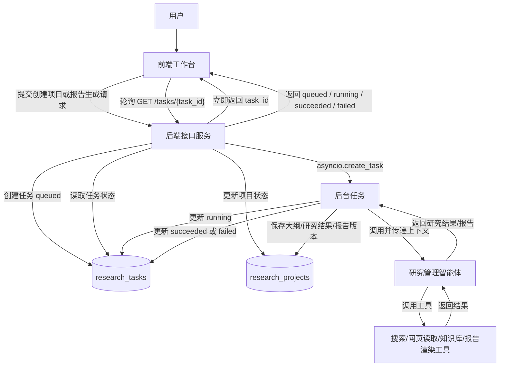
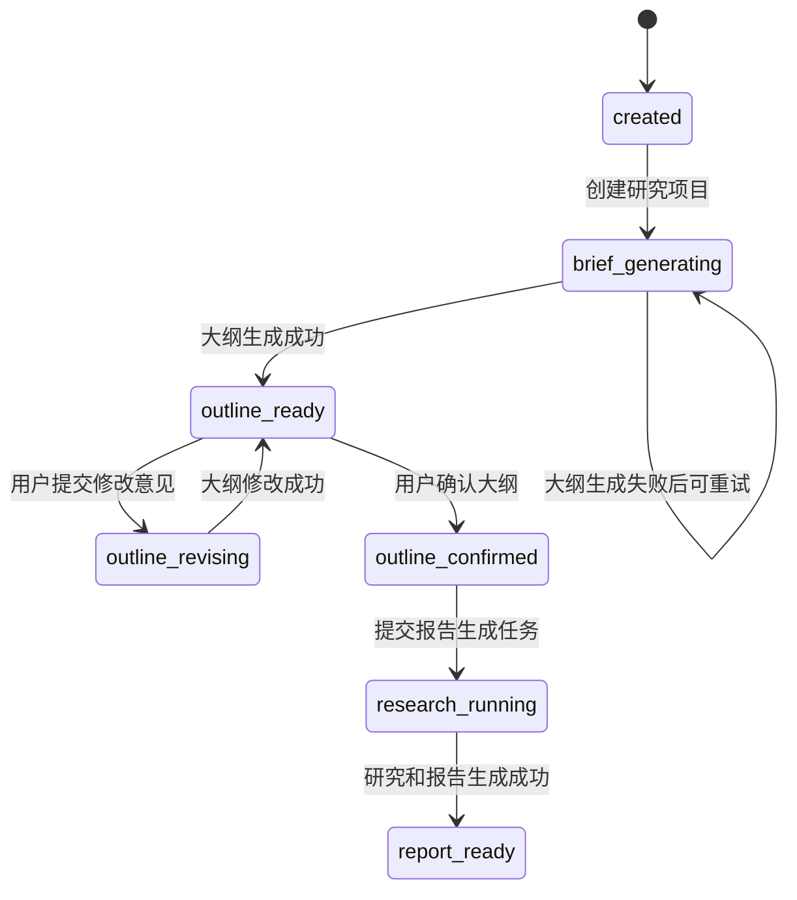
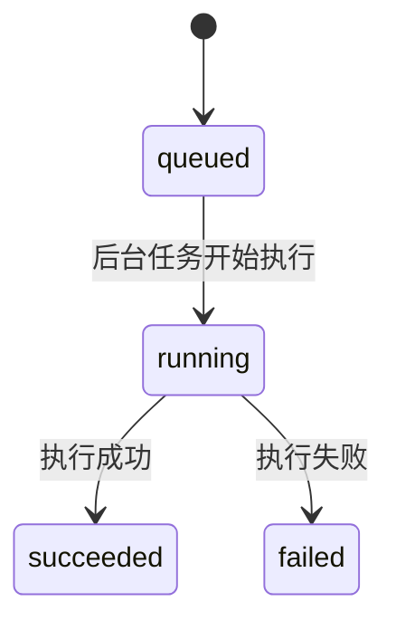
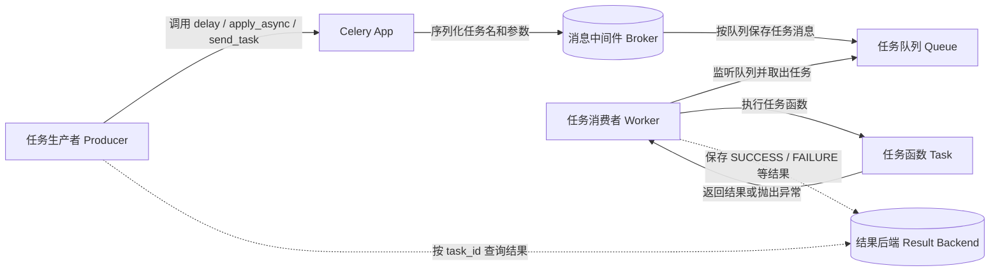
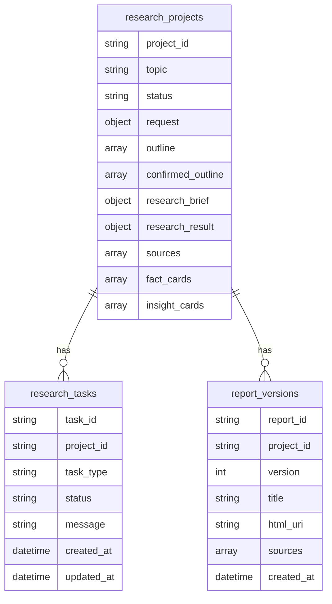

# 异步任务和数据存储

上一节已经初步将项目骨架搭建完毕：定义好了系统调用时序图、接口设计、Schema 结构和 FastAPI 路由入口。接下来，需要让这个系统具备两个能力：

1. 长耗时任务不能阻塞接口请求，要放到后台执行。

2. 项目、任务和报告结果不能只存在内存中，要持久化保存。

这两个能力对应本节的两个主题：

- 异步任务：解决“用户提交任务后，接口如何立即返回，后台如何继续执行”的问题。

- 数据存储：解决“项目状态、任务状态、大纲、研究结果和报告版本如何沉淀”的问题。

## 1. 异步任务

### 1.1 异步任务介绍

本项目中，创建大纲和具体研究过程都是长耗时任务。如果这些过程放在前台接口中同步执行，就会出现几个问题：

1. HTTP 请求会长时间等待，用户体验很差。

2. 搜索、网页读取、LLM 调用可能持续几十秒甚至几分钟，请求容易超时。

3. 如果中间失败，前端很难知道失败发生在哪个阶段。

4. 用户刷新页面后，系统必须还能查到任务当前状态。

因此，这些过程需要通过异步任务来实现：用户创建任务之后，接口立即返回；任务在后台执行；前端通过轮询任务状态接口，检测当前任务是否处理完成。

这也正是当前系统和普通对话系统不同的点：普通对话系统主要维护用户和 LLM 的历史对话记录；而当前系统维护的是多个用户提交的研究项目、多个后台任务，以及这些任务在不同时刻的状态。

异步任务的基本执行过程如下：



这个流程中，接口返回的不是最终报告，而是一个任务编号。任务编号是前端继续查询进度的依据。

例如，用户创建研究项目后，接口返回：

```json
{
  "project_id": "项目编号",
  "initial_task_id": "任务编号",
  "status": "brief_generating",
  "next_step": "wait_for_outline"
}
```

前端拿到 `initial_task_id` 后，可以调用：

```http
GET /api/v1/tasks/{task_id}
```

后台任务执行完成后，任务状态会从 `queued` 变成 `running`，最后变成 `succeeded` 或 `failed`。

### 1.2 创建异步任务的方式

#### 1.2.1 asyncio.create_task()

通过 `asyncio.create_task()`，可以将一个协程提交到当前事件循环中执行，避免阻塞当前请求处理流程。

准确地说，`asyncio.create_task()` 需要在已经运行的事件循环中调用。在 FastAPI 的异步接口和异步后台流程中，当前进程已经有事件循环，因此可以直接使用它提交协程任务。

先看一个最小示例：

```python
import asyncio

async def fetch_data(name, delay):
    print(f"{name}: 开始")
    await asyncio.sleep(delay)
    print(f"{name}: 结束")
    return name

async def demo_await():
    print("=== await 方式 ===")
    result = await fetch_data("A", 2)   # 开始执行 A，并等待 2 秒
    print("主协程拿到结果后继续")
    result = await fetch_data("B", 1)   # 等 A 完成才开始 B
    print("结束")

async def demo_create_task():
    print("=== create_task 方式 ===")
    task_a = asyncio.create_task(fetch_data("A", 2))
    task_b = asyncio.create_task(fetch_data("B", 1))
    print("两个任务已在后台运行，主协程继续")
    await asyncio.sleep(0.5)            # 主协程做其他事
    results = await asyncio.gather(task_a, task_b)  # 等待两者完成
    print("结束")

asyncio.run(demo_await())
asyncio.run(demo_create_task())
```

这段代码体现了 `await` 和 `create_task` 的区别：

| 写法                         | 行为                       |
| -------------------------- | ------------------------ |
| `await fetch_data(...)`    | 当前协程会等待这个任务执行完成，然后再继续往下走 |
| `asyncio.create_task(...)` | 把协程提交到事件循环中，当前协程可以继续往下走  |

在本项目中，路由层不会直接等待大纲生成或报告生成完成，而是创建任务记录后，调用后台任务启动函数：

```python
start_generate_research_brief_task(project_id=project_id, task_id=task.task_id)
```

后台任务模块内部再统一封装 `asyncio.create_task`：

```python
def _schedule_task(
    coroutine: Coroutine[Any, Any, None],
    task_name: str,
    project_id: str,
    task_id: str,
) -> None:
    asyncio.create_task(coroutine, name=f"{task_name}:{task_id}")
    logger.info(
        "后台任务已提交，task_name={}，project_id={}，task_id={}",
        task_name,
        project_id,
        task_id,
    )
```

这样做有两个好处：

1. `routers` 层不直接依赖 `asyncio.create_task`，只需要调用 `background` 模块提供的启动函数。

2. 后续如果从进程内后台任务升级到 Celery，只需要替换 `background` 模块，不需要大改接口层。

以“生成研究任务书和大纲”为例，启动函数只负责提交任务：

```python
def start_generate_research_brief_task(project_id: str, task_id: str) -> None:
    _schedule_task(
        _run_generate_research_brief_task(project_id=project_id, task_id=task_id),
        task_name="generate_research_brief",
        project_id=project_id,
        task_id=task_id,
    )
```

真正执行任务的是 `_run_generate_research_brief_task`：

```python
async def _run_generate_research_brief_task(project_id: str, task_id: str) -> None:
    try:
        await research_task_repository.mark_task_running(
            task_id=task_id,
            message="正在生成研究任务书和大纲",
        )
        await research_project_repository.update_project_status(
            project_id=project_id,
            status=ProjectStatus.BRIEF_GENERATING,
        )

        project = await research_project_repository.get_project(project_id=project_id)
        research_agent = get_research_agent()
        result = await research_agent.generate_research_brief(project=project)

        await research_project_repository.save_research_brief_and_outline(
            project_id=project_id,
            research_brief=result.research_brief,
            outline=result.outline,
        )
        await research_project_repository.update_project_status(
            project_id=project_id,
            status=ProjectStatus.OUTLINE_READY,
        )
        await research_task_repository.mark_task_succeeded(
            task_id=task_id,
            message="研究任务书和大纲已生成，等待用户确认",
        )
    except Exception as exc:
        await _mark_task_failed(
            project_id=project_id,
            task_id=task_id,
            message="研究任务书和大纲生成失败",
            exc=exc,
        )
```

这个函数的核心结构是固定的：

```text
标记任务 running
  -> 更新项目状态
  -> 读取项目数据
  -> 调用 Agent 或工具
  -> 保存结果
  -> 标记任务 succeeded
  -> 如果异常，标记任务 failed
```

#### 1.2.2 使用Celery框架(了解)

生产环境下，更推荐使用 Celery 这类任务队列框架来实现异步任务。使用 Celery，可以将任务创建过程和任务处理过程解耦，从而分别扩展 API 服务和任务执行服务。

进程内 `asyncio.create_task` 和 Celery 的区别如下：

| 方案                    | 优点                   | 局限                              | 适用阶段    |
| --------------------- | -------------------- | ------------------------------- | ------- |
| `asyncio.create_task` | 简单、没有额外组件、适合快速实现 MVP | API 进程重启后，正在执行的任务会丢失；不适合多实例任务调度 | 本项目第一版  |
| Celery                | 任务可排队、可重试、可分布式扩展     | 需要 Redis/RabbitMQ 等中间件，系统复杂度更高  | 生产化改造阶段 |

本项目第一版先使用 `asyncio.create_task`，原因是系统主线更清晰：先跑通创建项目、大纲生成、状态轮询、报告生成和结果保存，再考虑替换任务队列。

### 1.3 任务状态机

对于长耗时任务而言，可以通过任务状态机机制，管理任务的不同状态流转。通过状态机，可以把复杂、异步、易错的过程，变成可预测、可恢复、可观测的确定性流程。

那么什么是状态机呢？

状态机包含以下要素：

| 要素  | 说明                     |
| --- | ---------------------- |
| 状态  | 对象在某一个时刻所处的阶段          |
| 事件  | 触发状态变化的外部动作            |
| 转移  | 在某个状态下、发生某个事件后、去往下一个状态 |

以电商作为例子，我们通过电商平台购买的订单，本质上就是一个状态机：

```text
         [支付]           [发货]           [确认收货]
待支付  ───────→ 已支付 ───────→ 已发货 ───────→ 已完成
   │                            │
   │ [取消]                     │ [取消]
   ↓                            ↓
 已取消 ←──────────────────── 已取消（也可从已支付取消）
```

本项目所设计的任务状态，有如下两类：

第一类是研究项目状态，描述整个研究项目走到了哪个业务阶段：

| 项目状态                | 含义                   |
| ------------------- | -------------------- |
| `created`           | 项目已创建                |
| `brief_generating`  | 研究任务书和大纲生成中          |
| `outline_ready`     | 大纲草案已生成，等待用户确认       |
| `outline_revising`  | 用户提交了大纲修改意见，系统正在修改大纲 |
| `outline_confirmed` | 用户已确认大纲              |
| `research_running`  | 研究管理智能体正在协调信息检索和分析   |
| `report_ready`      | 报告已生成                |

第二类是后台任务状态，描述某一个后台任务的执行进度：

| 任务状态        | 含义         |
| ----------- | ---------- |
| `queued`    | 任务已创建，等待执行 |
| `running`   | 任务正在执行     |
| `succeeded` | 任务执行成功     |
| `failed`    | 任务执行失败     |

项目状态和任务状态要分开。一个项目可以有多个任务，例如：

| 任务类型                      | 触发动作       | 对应项目状态变化                              |
| ------------------------- | ---------- | ------------------------------------- |
| `generate_research_brief` | 创建研究项目     | `brief_generating` -> `outline_ready` |
| `revise_outline`          | 用户要求修改大纲   | `outline_ready` -> `outline_revising` |
| `generate_report`         | 用户提交报告生成任务 | `outline_ready` -> `report_running`   |

项目主状态流转如下：



后台任务状态流转如下：



这种设计可以让前端非常稳定地判断下一步动作：

- 项目是 `brief_generating`：前端展示“正在生成大纲”，并轮询任务状态。

- 项目是 `outline_ready`：前端展示大纲，并允许用户确认或修改。

- 项目是 `outline_confirmed`：前端展示“生成报告”按钮。

- 项目是 `research_running`：前端展示“正在生成报告”，并轮询任务状态。

- 项目是 `report_ready`：前端展示最新报告。

### 1.4 编码

异步任务相关编码主要涉及三个模块：

| 模块     | 文件                                           | 作用                                                                        |
| ------ | -------------------------------------------- | ------------------------------------------------------------------------- |
| 路由模块   | `app/routers/__init__.py`                    | 接收请求，调用app.background的start_xxx_task任务（例如start_outline_generation）来定义后台任务 |
| 后台任务模块 | `app/background/research_tasks.py`           | 实现start_xxx_task任务：使用asyncio.create_task或者是celery来创建任务                    |
| 任务仓储模块 | `app/repository/research_task_repository.py` | 创建任务、查询任务、更新任务状态等                                                         |

#### 1.4.1 路由模块

创建研究项目时，路由层的核心逻辑如下：

```python
# 1、从background.research_task中引入start_xxx方法
from app.background.research_task import start_generate_research_brief_task
task = await _create_task(
    project_id=project_id,
    task_type=TaskType.GENERATE_RESEARCH_BRIEF,
    message="研究任务书和大纲生成任务已创建",
)
await research_project_repository.create_project(
    project_id=project_id,
    request=request,
    topic=request.topic,
    status=ProjectStatus.BRIEF_GENERATING,
    created_at=created_at,
)
# 2、调用研究报告生成任务，此调用为非阻塞式调用
start_generate_research_brief_task(project_id=project_id, task_id=task.task_id)
# 3、直接返回响应
return ResearchProjectCreateResponse(
        project_id=project_id,
        initial_task_id=task.task_id,
        initial_task_type=TaskType.GENERATE_RESEARCH_BRIEF,
        topic=request.topic,
        status=ProjectStatus.BRIEF_GENERATING,
        next_step=NextStep.WAIT_FOR_OUTLINE,
        created_at=created_at,
    )
```

这里有三个动作：

1. 先创建后台任务记录，状态为 `queued`。

2. 再创建研究项目记录，项目状态为 `brief_generating`。

3. 最后启动后台任务，接口立即返回项目编号和任务编号。

#### 1.4.2 后台任务模块

所有任务，定义在`app.background`模块中，该模块暴露顶层的3个任务方法：

- start_generate_research_brief_task

- start_revise_outline_task

- start_generate_report_task

routers调用这些方法创建后台任务。这种隔离的好处是后面对后台任务处理方式的升级，不影响前端的routers模块代码。

##### 1.4.2.1 使用asyncio.create_task创建后台任务

以`start_generate_research_brief_task`为例，其具体的作用是：

1. 获取实际的`大纲生成`任务

2. 将其放到后台进行运行

具体实现如下所示：

```python
def start_generate_research_brief_task(project_id: str, task_id: str) -> None:
    """启动研究任务书和大纲生成后台任务。

    输入为研究项目编号和后台任务编号；该函数只负责把任务提交到当前 API 进程的
    asyncio 事件循环，不直接执行 Agent，也不返回任务结果。
    """

    _schedule_task(
        _run_generate_research_brief_task(project_id=project_id, task_id=task_id),
        task_name="generate_research_brief",
        project_id=project_id,
        task_id=task_id,
    )
```

其中`_run_generate_research_brief_task`为具体的大纲生成任务，为一个协程对象。

而_schedule_task为具体的调度逻辑，其实就是对asyncio.create_task的浅包装：

```python
import asyncio
def _schedule_task(
    coroutine: Coroutine[Any, Any, None],
    task_name: str,
    project_id: str,
    task_id: str,
) -> None:
    """把后台协程提交到当前事件循环。

    输入为待执行协程、任务名称、项目编号和任务编号；输出为空。该函数隔离
    asyncio.create_task，保证 routers 层不直接依赖具体的后台任务启动方式。
    """

    asyncio.create_task(coroutine, name=f"{task_name}:{task_id}")
    logger.info(
        "后台任务已提交，task_name={}，project_id={}，task_id={}",
        task_name,
        project_id,
        task_id,
    )
```

##### 1.4.2.2 使用Celery

在Celery中，有如下角色，多个角色之间的关系，如下图所示：



这张图需要强调几个角色：

1. Producer 负责任务投递，通常是 Web 服务、脚本或其他业务进程。

2. Broker 负责保存待执行任务消息，常见选择是 Redis 或 RabbitMQ。

3. Worker 负责从队列中取出任务，并在本进程中执行对应的 Task 函数。

4. Result Backend 是可选角色，用于保存任务执行结果和状态，例如 `SUCCESS`、`FAILURE`。

使用Celery进行分布式任务管理时，整体编码的流程如下所示：

1. 构建Celery App：Celery App类似于FastAPI App对象。Celery App包含了Broker地址，和Backend地址，以及任务定义等信息；

2. 定义celery task：将一个函数，定义成一个task；

3. 通过celery app，将task发送到broker当中去。

构建Celery App代码如下所示：

```python
from celery import Celery

from app.config.config import Settings, get_settings


def create_celery_app() -> Celery:
    """创建 Celery 应用实例，供 API 进程投递任务和 worker 进程消费任务。"""

    settings: Settings = get_settings()
    app = Celery(
        "deep_research",
        # 定义broker和backend
        broker=settings.celery_broker_url or settings.redis_url,
        include=["app.background.celery_tasks"],
    )
    app.conf.update(
        task_acks_late=True,
        task_reject_on_worker_lost=True,
        task_track_started=True,
        worker_prefetch_multiplier=1,
        timezone="Asia/Shanghai",
    )
    return app


celery_app = create_celery_app()
```

定义celery的task如下所示：

```python
import asyncio
from collections.abc import Awaitable, Callable
from typing import Any

from app.background import research_tasks
from app.celery_app import celery_app

_work_loop: asyncio.AbstractEventLoop | None = None

def _get_worker_loop() -> asyncio.AbstractEventLoop:
    global _work_loop
    if _work_loop is None:
        _work_loop = asyncio.new_event_loop()
        asyncio.set_event_loop(_work_loop)

    return _work_loop

def _run_async(coroutine_factory: Callable[[], Awaitable[None]]) -> None:
    """在 Celery 的同步 worker 入口中执行异步业务函数。"""
    loop = _get_worker_loop()
    loop.run_until_complete(coroutine_factory())


def _task_options(name: str) -> dict[str, Any]:
    return {
        "name": name,
        "autoretry_for": (Exception,),
        "retry_kwargs": {"max_retries": 3},
        "retry_backoff": True,
        "retry_jitter": True,
    }


@celery_app.task(**_task_options("research.generate_research_brief"))
def generate_research_brief_task(project_id: str, task_id: str) -> None:
    _run_async(
        lambda: research_tasks.run_generate_research_brief_task(
            project_id=project_id,
            task_id=task_id,
        )
    )


@celery_app.task(**_task_options("research.revise_outline"))
def revise_outline_task(project_id: str, task_id: str, revision_instruction: str) -> None:
    _run_async(
        lambda: research_tasks.run_revise_outline_task(
            project_id=project_id,
            task_id=task_id,
            revision_instruction=revision_instruction,
        )
    )


@celery_app.task(**_task_options("research.generate_report"))
def generate_report_task(
    project_id: str,
    task_id: str,
    user_instruction: str | None,
) -> None:
    _run_async(
        lambda: research_tasks.run_generate_report_task(
            project_id=project_id,
            task_id=task_id,
            user_instruction=user_instruction,
        )
    )


@celery_app.task(**_task_options("research.render_report"))
def render_report_task(
    project_id: str,
    task_id: str,
    user_instruction: str | None,
) -> None:
    _run_async(
        lambda: research_tasks.run_render_report_task(
            project_id=project_id,
            task_id=task_id,
            user_instruction=user_instruction,
        )
    )
```

将task通过app发送到broker当中：

```python
def start_generate_research_brief_task(project_id: str, task_id: str) -> None:
    """启动研究任务书和大纲生成后台任务。

    输入为研究项目编号和后台任务编号；该函数只负责把任务提交到celery 的broker中，
    供给celery worker进行消费。
    """

    _send_task(
        task_path="research.generate_research_brief",
        task_name="generate_research_brief",
        project_id=project_id,
        task_id=task_id,
        args=(project_id, task_id),
    )
def _send_task(
    task_path: str,
    task_name: str,
    project_id: str,
    task_id: str,
    args: tuple[Any, ...],
) -> None:
    """把后台任务投递到 Celery 队列。

    输入为 Celery 任务路径、任务名称、项目编号和任务参数；输出为空。该函数隔离
    Celery 投递细节，保证 routers 层不直接依赖具体的后台任务启动方式。
    """

    from app.celery_app import celery_app

    celery_app.send_task(task_path, args=args)
    logger.info(
        "后台任务已投递到 Celery，task_name={}，project_id={}，task_id={}",
        task_name,
        project_id,
        task_id,
    )
```

启动Celery Worker命令如下：

```bash
celery -A app.celery_app worker -l info --concurrency=1
```

## 2. 数据存储

### 2.1 数据存储节点

本项目中，需要持久化存储的数据有如下几类：

- 项目状态和项目基础数据。

- 任务状态和任务执行信息。

- 研究任务书和研究大纲。

- 结构化研究结果，包括章节、来源、事实卡片和洞察卡片。

- 报告相关数据，包括报告版本、HTML 存储位置和来源列表。

这些数据存在大量嵌套结构，而不是传统关系型数据库中二维表的平铺结构。例如，一个研究项目下面会包含大纲树、确认后的大纲、来源列表、事实卡片、洞察卡片和研究结果。

因此，本项目选择使用文档数据库作为数据存储方案。

当前系统主要包含三个集合：

| 集合                  | 保存内容                      | 对应仓储模块                           |
| ------------------- | ------------------------- | -------------------------------- |
| `research_projects` | 项目基础信息、项目状态、研究任务书、大纲、研究结果 | `research_project_repository.py` |
| `research_tasks`    | 后台任务编号、任务类型、任务状态、状态说明和时间  | `research_task_repository.py`    |
| `report_versions`   | 报告版本、标题、HTML 存储地址、来源列表    | `report_repository.py`           |

数据之间的关系如下：



在`research_projects`中，request存储的是，用户提交研究时的设定：

```text
{
    topic: '中国半导体行业的发展情况',
    research_goal: '研究各个梯队的玩家分别有哪些，以及在国际上面的影响力',
    target_audience: '投行',
    region_scope: 'global',
    time_scope: {
      type: 'recent_years',
      years: NumberInt('3')
    }
  }
```

research_brief存储的是大纲生成阶段的任务书：

```textile
{
    topic: '中国半导体行业的发展情况',
    research_goal: '研究各个梯队的玩家分别有哪些，以及在国际上面的影响力',
    target_audience: '投行',
    scope_summary: '研究范围覆盖中国半导体全产业链（IC设计、晶圆制造、封装测试、半导体设备、半导体材料、EDA/IP），以全球视角评估各环节的企业梯队划分与国际影响力。时间聚焦近3年数据与未来3年展望。',
    key_questions: [
      '中国半导体产业链各环节的企业梯队如何划分',
      '各梯队的代表企业有哪些，其营收规模和技术水平差异是什么',
      '中国半导体企业在国际市场上的竞争力和影响力处于什么水平',
      '地缘政治和技术封锁对中国半导体国际地位的影响有多大',
      '未来3年哪些细分环节存在明确的国产替代和投资机会'
    ],
    assumptions: [
      '研究以公开资料（企业财报、行业白皮书、WSTS/SIA数据、券商研报）为基础',
      '梯队划分优先参考营收规模和制程/技术水平两个维度',
      '国际影响力评估以市场份额、技术领先度和客户覆盖为三大基准'
    ],
    success_criteria: [
      '给出六大产业链环节的清晰梯队划分及代表企业列表',
      '各环节中国企业与国际领先者形成对标分析',
      '识别出2-3个具备明确投资价值的细分方向',
      '所有关键判断可追溯来源'
    ]
  }
```

### 2.2 文档数据库

#### 2.2.1 文档数据库介绍

文档数据库是一种**非关系型数据库（NoSQL）**，它使用**文档**作为数据存储的基本单位，而不是传统关系型数据库中的“行”和“列”。

可以把文档理解为一个**自包含的、结构灵活的数据对象**，最常见的表示格式是 **JSON**，在 MongoDB 中实际存储为 BSON。比如，一本书的信息、一个用户的资料、一个研究项目的数据，都可以存成一个文档。

关系型数据库和文档数据库的对比：

| 特性       | 关系型数据库               | 文档数据库                          |
| -------- | -------------------- | ------------------------------ |
| 基本存储单位   | 表中的一行                | 一个文档                           |
| 数据模型     | 严格、预先定义表结构，列和数据类型固定  | 灵活、动态的结构，文档内字段可以按业务扩展          |
| 数据关系     | 通过外键关联多个表，查询时常用 JOIN | 尽量把强相关数据保存在同一个文档中，减少跨表关联       |
| 一个用户数据示例 | 需要拆到用户表、地址表、订单表      | 一个 JSON 文档可以包含用户基本信息、地址列表和最近订单 |
| 适合场景     | 强事务、强关系、复杂联表查询       | 结构嵌套、字段变化快、读写以单个业务对象为中心        |

本项目选择文档数据库，是因为研究项目天然是一个文档型对象：

```json
{
  "project_id": "项目编号",
  "topic": "研究具身智能行业未来三年的机会",
  "status": "outline_ready",
  "request": {
    "research_goal": "判断公司是否需要关注该行业",
    "target_audience": "公司战略团队",
    "region_scope": "china"
  },
  "outline": [
    {
      "node_id": "1",
      "title": "行业定义和研究边界",
      "children": []
    }
  ],
  "sources": [],
  "fact_cards": [],
  "insight_cards": []
}
```

如果用关系型数据库，需要拆成项目表、大纲表、来源表、事实表、洞察表、报告表等多个表。第一版系统为了快速跑通主链路，使用 MongoDB 会更直接。

#### 2.2.2 MongoDB介绍

MongoDB 是一种常用的文档型数据库，支持文档存储、索引、聚合查询、分布式部署等能力。

MongoDB 中几个基本概念如下：

| 概念         | 含义   | 类比关系型数据库    |
| ---------- | ---- | ----------- |
| database   | 数据库  | database    |
| collection | 集合   | table       |
| document   | 文档   | row         |
| field      | 字段   | column      |
| `_id`      | 文档主键 | primary key |

在本项目中，MongoDB 主要承担三类职责：

1. 保存研究项目的主状态和研究过程产物。

2. 保存后台任务状态，支持前端轮询。

3. 保存报告版本元数据，支持读取最新报告。

MongoDB 的使用不会直接写在路由函数中，而是封装在 repository 层。这样做的目的，是让接口层保持清晰：

```text
routers
  -> repository
  -> MongoDB
```

#### 2.2.3 MongoDB编码示例

通过 MongoDB 编码，和使用 MySQL 类似，但又稍有不同，具体如下：

1. 创建客户端对象。

2. 连接到特定的数据库。

3. 插入/读取数据。

具体各个环节编码：

1、创建客户端对象

```python
from pymongo import AsyncMongoClient

_mongodb_client = AsyncMongoClient(
    "mongodb://localhost:27017",
    # 5s内找不到可用的MongoDB服务器，就报错，不会无限等待
    serverSelectionTimeoutMS=5000,
)
```

在项目代码中，MongoDB 客户端被封装在 `app/repository/mongodb.py` 中：

```python
_mongodb_client: AsyncMongoClient | None = None

def get_mongodb_client() -> AsyncMongoClient:
    global _mongodb_client
    if _mongodb_client is None:
        settings: Settings = get_settings()
        _mongodb_client = AsyncMongoClient(
            settings.mongodb_uri,
            serverSelectionTimeoutMS=5000,
        )
    return _mongodb_client
```

这里没有每次调用都重新创建客户端，而是在当前进程内复用同一个 `AsyncMongoClient`。MongoDB 客户端内部会维护连接池。

2、连接到特定的数据库

```python
def get_mongodb_database() -> AsyncDatabase:
    settings: Settings = get_settings()
    return get_mongodb_client()[settings.mongodb_database]
```

例如配置中 `mongodb_database = "deep_research"`，那么这里拿到的就是 `deep_research` 数据库。

3、选择集合并插入数据

```python
async def create_task(
    task_id: str,
    project_id: str,
    task_type: TaskType,
    status: TaskStatus,
    message: str,
    created_at: datetime,
    updated_at: datetime,
) -> TaskStatusResponse:
    task = TaskStatusResponse(
        task_id=task_id,
        project_id=project_id,
        task_type=task_type,
        status=status,
        message=message,
        created_at=created_at,
        updated_at=updated_at,
    )
    document = task.model_dump(mode="python")
    document["_id"] = task_id
    await _get_collection().insert_one(document)
    return task
```

这里的 `_get_collection()` 返回的是 `research_tasks` 集合：

```python
COLLECTION_NAME = "research_tasks"

def _get_collection():
    return get_mongodb_database()[COLLECTION_NAME]
```

4、读取数据

```python
async def get_task(task_id: str) -> TaskStatusResponse | None:
    document = await _get_collection().find_one({"task_id": task_id})
    return _task_from_document(document)
```

MongoDB 返回的是普通字典，需要转换成接口响应结构：

```python
def _task_from_document(document: dict[str, object] | None) -> TaskStatusResponse | None:
    if document is None:
        return None
    return TaskStatusResponse(
        task_id=str(document["task_id"]),
        project_id=str(document["project_id"]),
        task_type=TaskType(str(document["task_type"])),
        status=TaskStatus(str(document["status"])),
        message=str(document["message"]),
        created_at=document["created_at"],
        updated_at=document["updated_at"],
    )
```

5、更新数据

```python
async def _update_task_status(task_id: str, status: TaskStatus, message: str) -> None:
    await _get_collection().update_one(
        {"task_id": task_id},
        {
            "$set": {
                "status": status,
                "message": message,
                "updated_at": utc_now(),
            }
        },
    )
```

MongoDB 更新时通常使用 `$set` 指定要修改的字段。这样不会覆盖整个文档，只会更新指定字段。

### 2.3 编码

现在，可以将 `research_project_repository.py`、`research_task_repository.py` 以及 `report_repository.py` 当中的具体实现进行补充。

Repository 层的作用，是把数据库读写从路由和后台任务中隔离出来。路由层只关心“我要创建任务、我要读取报告”，不关心 MongoDB 集合叫什么、`insert_one` 和 `update_one` 怎么写。

本项目三个核心 repository 的职责如下：

| 文件                               | 职责                             |
| -------------------------------- | ------------------------------ |
| `research_project_repository.py` | 保存项目、更新项目状态、保存大纲、保存确认大纲、保存研究结果 |
| `research_task_repository.py`    | 创建任务、查询任务、更新任务状态               |
| `report_repository.py`           | 保存报告版本、读取最新报告                  |

#### 研究项目 repository

创建项目时，需要保存用户请求、项目状态和后续研究过程要用到的字段：

```python
async def create_project(
    project_id: str,
    request: ResearchProjectCreate,
    topic: str,
    status: ProjectStatus,
    created_at: datetime,
) -> dict[str, Any]:
    document: dict[str, Any] = {
        "_id": project_id,
        "project_id": project_id,
        "topic": topic,
        "request": request.model_dump(mode="python"),
        "status": status,
        "outline": [],
        "confirmed_outline": [],
        "research_brief": None,
        "research_result": None,
        "sections": [],
        "sources": [],
        "fact_cards": [],
        "insight_cards": [],
        "created_at": created_at,
        "updated_at": created_at,
    }
    await _get_collection().insert_one(document)
    return _clean_document(document) or {}
```

大纲生成完成后，需要保存研究任务书和大纲：

```python
async def save_research_brief_and_outline(
    project_id: str,
    research_brief: Any,
    outline: list[OutlineNode] | list[dict[str, Any]],
) -> None:
    await _get_collection().update_one(
        {"project_id": project_id},
        {
            "$set": {
                "research_brief": _dump_value(research_brief),
                "outline": _dump_outline(outline),
                "updated_at": utc_now(),
            }
        },
    )
```

用户确认大纲后，需要保存确认快照：

```python
async def save_confirmed_outline(
    project_id: str,
    outline: list[OutlineNode] | list[dict[str, Any]],
) -> None:
    await _get_collection().update_one(
        {"project_id": project_id},
        {"$set": {"confirmed_outline": _dump_outline(outline), "updated_at": utc_now()}},
    )
```

#### 任务 repository

任务 repository 的核心是记录任务状态：

```python
async def create_task(
    task_id: str,
    project_id: str,
    task_type: TaskType,
    status: TaskStatus,
    message: str,
    created_at: datetime,
    updated_at: datetime,
) -> TaskStatusResponse:
    task = TaskStatusResponse(
        task_id=task_id,
        project_id=project_id,
        task_type=task_type,
        status=status,
        message=message,
        created_at=created_at,
        updated_at=updated_at,
    )
    document = task.model_dump(mode="python")
    document["_id"] = task_id
    await _get_collection().insert_one(document)
    return task
```

查询任务状态：

```python
async def get_task(task_id: str) -> TaskStatusResponse | None:
    document = await _get_collection().find_one({"task_id": task_id})
    return _task_from_document(document)
```

更新任务状态：

```python
async def mark_task_running(task_id: str, message: str) -> None:
    await _update_task_status(task_id=task_id, status=TaskStatus.RUNNING, message=message)

async def mark_task_succeeded(task_id: str, message: str) -> None:
    await _update_task_status(task_id=task_id, status=TaskStatus.SUCCEEDED, message=message)

async def mark_task_failed(task_id: str, message: str) -> None:
    await _update_task_status(task_id=task_id, status=TaskStatus.FAILED, message=message)
```

#### 报告 repository

报告生成完成后，需要保存报告版本。报告版本单独保存，而不是直接覆盖项目文档中的某个字段，原因是后续可能支持多次生成、多版本对比和重新渲染。

```python
async def save_report_version(
    project_id: str,
    title: str,
    html: str,
    sources: list[ReportSource] | list[dict[str, Any]],
) -> LatestReportResponse:
    latest_document = await _get_collection().find_one(
        {"project_id": project_id},
        sort=[("version", -1)],
        projection={"version": 1},
    )
    next_version = int(latest_document["version"]) + 1 if latest_document else 1
    created_at = utc_now()
    report_id = str(uuid4())
    stored_object = await get_report_object_storage().save_html(
        project_id=project_id,
        report_id=report_id,
        version=next_version,
        html=html,
    )
    report = LatestReportResponse(
        project_id=project_id,
        report_id=report_id,
        version=next_version,
        title=title,
        html=html,
        sources=[ReportSource.model_validate(source) for source in _dump_sources(sources)],
        created_at=created_at,
    )
    document = report.model_dump(mode="python", exclude={"html"})
    document["_id"] = report.report_id
    document["html_uri"] = stored_object.uri
    document["html_path"] = stored_object.path
    document["html_size"] = stored_object.size
    await _get_collection().insert_one(document)
    return report
```

读取最新报告时，只需要按版本倒序取第一条：

```python
async def get_latest_report(project_id: str) -> LatestReportResponse | None:
    document = await _get_collection().find_one(
        {"project_id": project_id},
        sort=[("version", -1)],
    )
    return await _report_from_document(document)
```

最终，异步任务和数据存储会组成一条完整链路：

```text
router 创建任务
  -> research_task_repository 保存 queued
  -> background 启动后台协程
  -> background 更新 running
  -> Agent / tools 执行长耗时逻辑
  -> research_project_repository 保存过程结果
  -> report_repository 保存报告版本
  -> research_task_repository 更新 succeeded 或 failed
  -> 前端通过 task_id 查询任务状态
```

这条链路跑通之后，系统就不再只是一个接口骨架，而是具备了后台执行、状态追踪和结果沉淀能力。
