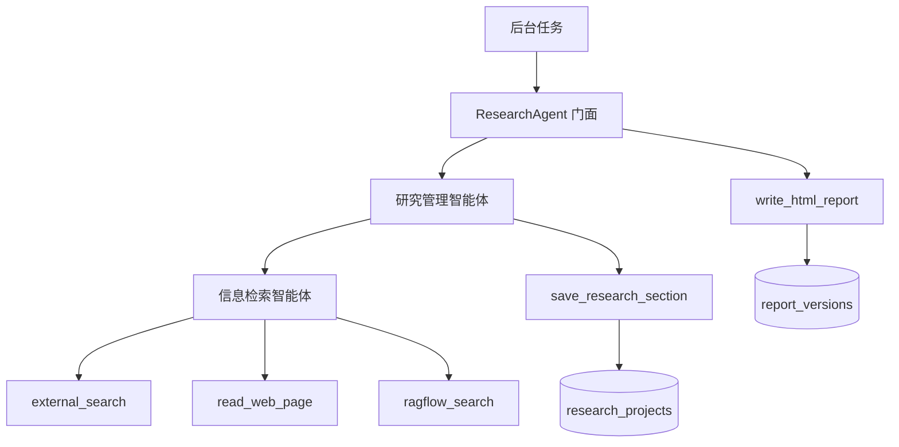

# Agent设计与开发

## 1. Agent总设计

当前项目中，仅在大纲制定环节和研究执行环节使用智能体。报告生成阶段不再额外构建“报告写作 Agent”，而是使用确定性的报告渲染工具，把已经落库的结构化研究结果转换成 HTML。

整个 Agent 链路可以拆成两层：

| 层级   | 名称      | 作用                                        |
| ---- | ------- | ----------------------------------------- |
| 主智能体 | 研究管理智能体 | 理解研究任务、生成大纲、修改大纲、拆解章节、协调检索、整理事实和洞察、写出章节正文 |
| 子智能体 | 信息检索智能体 | 围绕主智能体分派的问题进行公开搜索、网页读取、内部知识库检索和事实整理       |

报告阶段的职责边界如下：

| 阶段         | 是否使用 LLM Agent      | 产物                                                |
| ---------- | ------------------- | ------------------------------------------------- |
| 生成研究任务书和大纲 | 使用研究管理智能体           | `research_brief`、`outline`                        |
| 修改大纲       | 使用研究管理智能体           | 修订后的 `outline`                                    |
| 执行研究       | 使用研究管理智能体 + 信息检索智能体 | `sections`、`sources`、`fact_cards`、`insight_cards` |
| 渲染报告       | 不使用报告 Agent         | HTML、目录、引用、参考来源                                   |

这个设计的核心原因是：研究过程需要 LLM 进行理解、拆解、检索规划、归纳和写作；但报告渲染阶段主要是结构转换和页面展示，不应该让 LLM 重新补写事实、改写证据链或生成新的来源。

整体流程如下：



## 2. 研究Agent设计

在前面的架构设计环节，整个研究过程已经拆成两个 Agent：一个是主研究管理者，另一个专门负责收集信息、整理来源并构建事实证据链。

这里要注意一个边界：信息检索智能体不是“帮忙写报告”的智能体，它只负责证据材料；主研究智能体才负责把证据组织成章节正文和研究结果。

### 2.1 主研究智能体的职责

主研究智能体负责：

- 基于用户的问题，构建研究任务书和研究大纲。

- 基于用户对大纲的修改意见，修改大纲。

- 基于已确认大纲，拆解每个章节需要回答的问题。

- 将检索问题分派给信息检索智能体。

- 整理来源、事实卡片、冲突信息和洞察卡片。

- 写出每个章节的完整正文。

- 为关键判断构建证据链。

- 调用 `save_research_section` 工具，将章节研究结果保存至数据库。

主研究智能体不负责：

- 不直接调用互联网搜索工具。

- 不直接读取网页正文。

- 不直接调用 RAGFlow。

- 不直接编写最终 HTML。

- 不调用报告写作 Agent。

- 不保存项目状态和任务状态。

主研究智能体的核心输入输出如下：

| 任务类型                      | 输入                 | 输出         |
| ------------------------- | ------------------ | ---------- |
| `generate_research_brief` | 项目主题、目标、读者、地域和时间范围 | 研究任务书、大纲草案 |
| `revise_outline`          | 当前大纲、用户修改意见        | 修订后的大纲     |
| `generate_report`         | 已确认大纲、项目设定、用户补充要求  | 逐章节保存的研究结果 |

项目中使用 `ResearchAgent` 类作为业务门面，后台任务不直接操作 DeepAgents 对象：

```python
class ResearchAgent:
    """研究智能体业务门面。"""

    def __init__(self, manager_agent: Any | None = None, report_agent: Any | None = None) -> None:
        self.manager_agent = manager_agent
        self.report_agent = report_agent

    async def generate_research_brief(self, project: dict[str, Any] | None) -> ResearchBriefResult:
        payload = self._build_generate_research_brief_input(project=project)
        raw_result = await self._invoke_manager_agent(
            task_name="generate_research_brief",
            payload=payload,
        )
        return self._parse_research_brief_result(raw_result=raw_result, project=project)

    async def revise_outline(
        self,
        project: dict[str, Any] | None,
        outline: list[OutlineNode],
        revision_instruction: str,
    ) -> list[OutlineNode]:
        payload = self._build_revise_outline_input(
            project=project,
            outline=outline,
            revision_instruction=revision_instruction,
        )
        raw_result = await self._invoke_manager_agent(
            task_name="revise_outline",
            payload=payload,
        )
        return self._parse_outline_result(raw_result=raw_result, fallback_outline=outline)
```

研究执行阶段不是一次性要求模型返回一个巨大的 `research_result`，而是要求主智能体逐章节调用工具落库：

```python
async def generate_research_result(
    self,
    project: dict[str, Any] | None,
    outline: list[OutlineNode],
    user_instruction: str | None,
) -> ResearchResult:
    project_id = self._get_project_id(project=project)
    await research_project_repository.clear_research_sections(project_id=project_id)
    expected_section_ids = self._expected_research_section_ids(outline=outline)
    sections: list[dict[str, Any]] = []
    missing_section_ids = sorted(expected_section_ids)

    for attempt in range(1, 5):
        payload = self._build_generate_research_result_input(
            project=project,
            outline=outline,
            user_instruction=user_instruction,
            required_section_ids=sorted(expected_section_ids),
            missing_section_ids=missing_section_ids,
            attempt=attempt,
        )
        await self._invoke_manager_agent(task_name="generate_report", payload=payload)
        sections = await research_project_repository.get_research_sections(project_id=project_id)
        saved_section_ids = {
            str(section.get("section_id"))
            for section in sections
            if isinstance(section, dict) and section.get("section_id")
        }
        missing_section_ids = sorted(expected_section_ids - saved_section_ids)
        if not missing_section_ids:
            break

    return self._build_research_result_from_saved_sections(
        sections=sections,
        sources=await research_project_repository.get_research_sources(project_id=project_id),
        project=project,
        outline=outline,
    )
```

这里有一个重要设计：如果部分章节没有被保存，系统会把缺失的 `section_id` 重新传给主智能体，要求它补写缺失章节。这样可以避免一次大输出中遗漏章节。

主研究智能体的 Prompt 核心片段如下：

```markdown
你是 AI 研究报告工作台中的研究管理智能体。

你的职责是完成研究本身：理解任务、设计大纲、协调信息检索、整理事实、形成洞察、写出完整章节正文，并产出可落库的结构化研究结果。

你不是报告渲染智能体。你不负责把研究结果渲染为最终 HTML。报告渲染由后端确定性渲染流程基于你落库的 `research_result` 完成。
```

针对 `generate_report` 任务，Prompt 明确要求主智能体逐章节保存结果：

```markdown
目标：根据已确认大纲完成逐章节研究，并通过 `save_research_section` 工具把每个有正文的章节写入数据库。不要一次性输出完整 `research_result`。

流程要求：

1. 基于已确认大纲识别需要写正文的章节。
2. 如果任务载荷中存在 `missing_section_ids`，本轮只处理这些章节，不要重写已保存章节。
3. 对每个章节拆解检索问题，委托信息检索智能体获取公开来源和可复核事实。
4. 写出该章节完整正文、关键发现、证据链、表格/图表结构、风险说明和本章来源详情。
5. 调用 `save_research_section(project_id, section)` 保存该章节。
```

### 2.2 信息检索智能体的职责

信息检索智能体负责：

- 基于主研究智能体分派的问题，构造搜索关键词。

- 使用公开互联网搜索工具发现资料来源。

- 使用网页读取工具读取关键网页正文和元数据。

- 按需使用 RAGFlow 工具检索内部知识库。

- 对来源进行去重和相关性判断。

- 从来源中提取可复核事实。

- 标注每条事实对应的来源。

- 识别不同来源之间的冲突、口径差异和不确定性。

信息检索智能体不负责：

- 不设计完整研究大纲。

- 不生成最终 HTML 报告。

- 不编造 URL、日期、机构名称或数据。

- 不把搜索摘要直接当作最终事实。

- 不保存数据库状态。

信息检索智能体可以使用的工具如下：

| 工具                | 文件                             | 作用                  |
| ----------------- | ------------------------------ | ------------------- |
| `external_search` | `app/tools/external_search.py` | 调用 Tavily 搜索公开互联网资料 |
| `read_web_page`   | `app/tools/web_reader.py`      | 读取网页正文、标题、发布时间线索    |
| `ragflow_search`  | `app/tools/ragflow_search.py`  | 检索 RAGFlow 内部知识库    |

公开互联网搜索工具的核心结构如下：

```python
async def external_search(
    query: str,
    max_results: int = 5,
    search_depth: str = "basic",
    include_domains: list[str] | None = None,
    exclude_domains: list[str] | None = None,
    time_range: str | None = None,
    start_date: str | None = None,
    end_date: str | None = None,
) -> dict[str, Any]:
    normalized_query = query.strip()
    if not normalized_query:
        return {
            "status": "error",
            "provider": "tavily",
            "query": query,
            "results": [],
            "error": "query 不能为空",
        }

    settings = get_settings()
    if not settings.tavily_api_key:
        return {
            "status": "skipped",
            "provider": "tavily",
            "query": normalized_query,
            "results": [],
            "error": "TAVILY_API_KEY 未配置",
        }
```

网页读取工具的核心结构如下：

```python
async def read_web_page(url: str, max_chars: int = DEFAULT_MAX_CHARS) -> dict[str, Any]:
    normalized_url = url.strip()
    if not normalized_url.startswith(("http://", "https://")):
        return {
            "status": "error",
            "url": url,
            "title": None,
            "published_at": None,
            "content": "",
            "error": "仅支持 http 或 https URL",
        }

    html, final_url, content_type = await asyncio.to_thread(_fetch_html, normalized_url)
```

RAGFlow 检索工具的核心结构如下：

```python
async def ragflow_search(
    query: str,
    dataset_ids: list[str] | None = None,
    document_ids: list[str] | None = None,
    page: int = 1,
    page_size: int = 10,
    similarity_threshold: float = 0.2,
    vector_similarity_weight: float = 0.3,
    top_k: int = 1024,
    keyword: bool = False,
) -> dict[str, Any]:
    normalized_query = query.strip()
    if not normalized_query:
        return {
            "status": "error",
            "provider": "ragflow",
            "query": query,
            "chunks": [],
            "error": "query 不能为空",
        }
```

信息检索智能体的 Prompt 核心片段如下：

```markdown
你是 AI 研究报告工作台中的信息检索智能体。

你的职责是围绕研究管理智能体分派的问题进行资料检索、网页读取、内部知识库检索、事实整理和证据链输出。

搜索工具用于发现来源，不把搜索摘要直接当作最终事实。
网页读取工具用于获取可追溯正文和来源元数据。
RAGFlow 工具用于检索内部知识库，不把内部资料伪装成公开来源。
```

信息检索智能体的最终输出必须是严格 JSON：

```json
{
  "sources": [
    {
      "source_id": "source-1",
      "title": "来源标题",
      "url": "https://example.com",
      "published_at": "2026-01-01",
      "source_type": "public_web",
      "summary": "来源摘要"
    }
  ],
  "fact_cards": [
    {
      "fact_id": "fact-1",
      "statement": "可复核事实",
      "source_ids": ["source-1"],
      "confidence": "medium",
      "evidence_summary": "证据摘要"
    }
  ],
  "conflicts": []
}
```

### 2.3 其他可扩展的智能体

在实际生产环境下，本项目还可以继续扩展更多智能体，但第一版不需要一次性拆太多 Agent。拆分智能体的原则是：只有当某类任务有独立工具、独立上下文和独立输出结构时，才适合拆成单独智能体。

可扩展方向包括：

- 问数智能体：面向企业内部结构化数据库，负责 SQL 生成、指标查询和数据解释。

- 竞品分析智能体：专门跟踪公司、产品、融资、价格、渠道和客户案例。

- 政策分析智能体：专门检索政策文件、监管动态、官方解读和政策影响。

- 财务分析智能体：专门处理财报、公告、经营数据和估值指标。

- 图表规划智能体：根据研究结果规划适合展示的图表类型和数据结构。

这些智能体都不应该改变当前系统的主边界：研究管理智能体负责协调研究过程，报告最终由确定性渲染流程生成。

## 3. 开发

### 3.1 多智能体架构的难点

多智能体架构的难点不在于“创建多个 Agent”，而在于职责边界和数据边界是否清晰。

本项目需要处理几个问题：

1. 谁负责拆解研究问题？

2. 谁负责检索资料？

3. 谁负责判断来源是否可用？

4. 谁负责把事实写成章节正文？

5. 谁负责保存研究结果？

6. 谁负责生成最终 HTML？

如果边界不清晰，很容易出现以下问题：

| 问题                | 结果                   |
| ----------------- | -------------------- |
| 主智能体也搜索，检索智能体也写报告 | 职责混乱，输出不可控           |
| 报告阶段继续让 LLM 补内容   | 来源和事实链条断裂            |
| 所有结果一次性塞进上下文      | 内容过长，模型容易遗漏章节        |
| 只返回自然语言结果         | 后端无法稳定落库和渲染          |
| 工具返回异常没有结构化       | Agent 不知道应该重试、跳过还是降级 |

因此，本项目采用以下约束：

- 主研究智能体只协调研究过程，不直接执行搜索和网页读取。

- 信息检索智能体只处理来源、事实和冲突，不写最终报告。

- 主研究智能体必须通过 `save_research_section` 工具逐章节落库。

- 报告渲染工具只做 HTML 展示转换，不新增事实、来源和结论。

- 所有关键产物都使用 Pydantic 结构描述。

核心结构包括：

```python
class FactCard(BaseModel):
    fact_id: str
    statement: str
    source_ids: list[str] = Field(default_factory=list)
    confidence: str = "medium"


class InsightCard(BaseModel):
    insight_id: str
    title: str
    summary: str
    supporting_fact_ids: list[str] = Field(default_factory=list)


class EvidenceItem(BaseModel):
    claim: str
    fact_ids: list[str] = Field(default_factory=list)
    source_ids: list[str] = Field(default_factory=list)
    confidence: str = "medium"
```

章节研究结果结构如下：

```python
class ResearchSection(BaseModel):
    section_id: str
    title: str
    summary: str | None = None
    body: str
    key_findings: list[str] = Field(default_factory=list)
    evidence_chain: list[EvidenceItem] = Field(default_factory=list)
    sources: list[ReportSource] = Field(default_factory=list)
    tables: list[dict[str, Any]] = Field(default_factory=list)
    charts: list[dict[str, Any]] = Field(default_factory=list)
    risks: list[str] = Field(default_factory=list)
```

完整研究结果结构如下：

```python
class ResearchResult(BaseModel):
    title: str
    executive_summary: str | None = None
    sections: list[ResearchSection] = Field(default_factory=list)
    sources: list[ReportSource] = Field(default_factory=list)
    fact_cards: list[FactCard] = Field(default_factory=list)
    insight_cards: list[InsightCard] = Field(default_factory=list)
    synthesis: ResearchSynthesis | None = None
```

这些结构就是研究阶段和报告渲染阶段之间的边界对象。

### 3.2 DeepAgents框架的介绍

DeepAgents 用于构建能够规划任务、调用工具、委托子智能体并维护上下文文件系统的 Agent。

在本项目中，DeepAgents 主要提供四类能力：

| 能力   | 在本项目中的作用                                                                      |
| ---- | ----------------------------------------------------------------------------- |
| 主智能体 | 构建研究管理智能体                                                                     |
| 子智能体 | 构建信息检索智能体                                                                     |
| 工具调用 | 调用 `save_research_section`、`external_search`、`read_web_page`、`ragflow_search` |
| 文件系统 | 把大规模检索结果、来源列表和中间材料写入 `/research/workspace/`，避免上下文膨胀                           |

主智能体构建代码如下：

```python
def _build_deepagents_manager_agent() -> Any | None:
    settings: Settings = get_settings()
    model_name = _build_model_name(settings=settings)
    subagents = [_build_search_subagent(model_name=model_name)]
    return create_deep_agent(
        model=model_name,
        tools=[save_research_section],
        system_prompt=_load_prompt(RESEARCH_MANAGER_PROMPT_PATH),
        subagents=subagents,
        name="research-manager-agent",
        checkpointer=MemorySaver(),
    )
```

信息检索子智能体构建代码如下：

```python
def _build_search_subagent(model_name: str) -> dict[str, Any]:
    settings: Settings = get_settings()
    if settings.enable_ragflow:
        tools = [external_search, read_web_page, ragflow_search]
    else:
        tools = [external_search, read_web_page]
    return {
        "name": "search-agent",
        "description": "负责公开互联网检索、网页读取、RAGFlow 内部知识库检索和证据整理。",
        "system_prompt": _load_prompt(SEARCH_AGENT_PROMPT_PATH),
        "tools": tools,
        "model": model_name,
    }
```

Prompt 不写死在代码中，而是维护在外部 Markdown 文件：

```python
PROMPT_DIR = Path(__file__).resolve().parent / "prompts"
RESEARCH_MANAGER_PROMPT_PATH = PROMPT_DIR / "research_manager.md"
SEARCH_AGENT_PROMPT_PATH = PROMPT_DIR / "search_agent.md"

def _load_prompt(prompt_path: Path) -> str:
    return prompt_path.read_text(encoding="utf-8").strip()
```

模型名称通过配置生成：

```python
def _build_model_name(settings: Settings) -> str:
    provider = settings.llm_provider.lower()
    if provider == "deepseek":
        return f"deepseek:{settings.llm_model_name}"
    if provider == "openai":
        return f"openai:{settings.llm_model_name}"
    return f"{provider}:{settings.llm_model_name}"
```

调用 DeepAgents 时，大 payload 不直接塞进消息正文，而是写入虚拟文件系统：

```python
def _build_deepagents_input(self, payload: dict[str, Any]) -> dict[str, Any]:
    task_json = json.dumps(payload, ensure_ascii=False, indent=2, default=self._json_default)
    return {
        "messages": [
            {
                "role": "user",
                "content": (
                    "请执行 /research/task_payload.json 中的研究任务。"
                    "先使用 todo 规划步骤；大规模检索结果和报告中间稿请写入"
                    " /research/workspace/ 下的文件；最终只返回严格 JSON。"
                ),
            }
        ],
        "files": {
            "/research/task_payload.json": create_file_data(task_json),
            "/research/workspace/README.md": create_file_data(
                "该目录用于保存检索摘要、来源整理、事实卡片、洞察卡片和报告草稿。"
            ),
        },
    }
```

这里的设计重点是：消息里只告诉智能体任务文件路径，大量输入数据放到 `/research/task_payload.json`，中间材料放到 `/research/workspace/`。

### 3.3 编码

Agent 编码可以按下面的顺序实现：

1. 定义结构化输出模型。

2. 编写工具函数。

3. 编写 Prompt 文件。

4. 构建 DeepAgents 主智能体和子智能体。

5. 编写 `ResearchAgent` 业务门面。

6. 在后台任务中调用 `ResearchAgent`。

#### 1. 定义结构化输出模型

研究任务书结构：

```python
class ResearchBrief(BaseModel):
    topic: str
    research_goal: str
    target_audience: str
    scope_summary: str
    key_questions: list[str] = Field(default_factory=list)
    assumptions: list[str] = Field(default_factory=list)
    success_criteria: list[str] = Field(default_factory=list)
```

研究任务书和大纲生成结果：

```python
class ResearchBriefResult(BaseModel):
    research_brief: ResearchBrief
    outline: list[OutlineNode]
```

报告渲染结果：

```python
class ReportGenerationResult(BaseModel):
    title: str
    html: str
    sources: list[ReportSource] = Field(default_factory=list)
    fact_cards: list[FactCard] = Field(default_factory=list)
    insight_cards: list[InsightCard] = Field(default_factory=list)
```

#### 2. 编写章节保存工具

主研究智能体生成章节正文后，需要调用 `save_research_section` 保存章节。这个工具会校验章节是否完整，避免占位内容进入报告。

```python
async def save_research_section(project_id: str, section: dict[str, Any]) -> dict[str, Any]:
    errors = await _validate_section(project_id=project_id, section=section)
    if errors:
        return {"ok": False, "errors": errors}

    normalized_sources = await _normalize_section_sources(
        project_id=project_id,
        section=section,
    )
    normalized_section = _normalize_section(section, sources=normalized_sources)
    await research_project_repository.upsert_research_section(
        project_id=project_id,
        section=normalized_section,
    )
    if normalized_sources:
        await research_project_repository.upsert_research_sources(
            project_id=project_id,
            sources=normalized_sources,
        )
    return {
        "ok": True,
        "project_id": project_id,
        "section_id": normalized_section["section_id"],
        "sources_saved": len(normalized_sources),
        "message": "research section saved",
    }
```

工具校验规则包括：

- `section_id` 必须存在，并且属于已确认大纲。

- `body` 必须是完整正文，不能是占位文案。

- `key_findings` 至少有一条非空关键发现。

- `evidence_chain` 至少有一条证据链。

- `evidence_chain.source_ids` 引用的来源必须能在 `section.sources` 或项目已有来源中找到。

#### 3. 构建 Agent 单例

后台任务通过 `get_research_agent()` 获取当前进程内复用的 Agent 门面：

```python
_research_agent: ResearchAgent | None = None

def build_research_agent() -> ResearchAgent:
    manager_agent = _build_deepagents_manager_agent()
    return ResearchAgent(manager_agent=manager_agent, report_agent=None)

def get_research_agent() -> ResearchAgent:
    global _research_agent
    if _research_agent is None:
        _research_agent = build_research_agent()
        logger.info("研究智能体门面已初始化")
    return _research_agent
```

#### 4. 后台任务调用 Agent

生成大纲任务中调用 `generate_research_brief`：

```python
project = await research_project_repository.get_project(project_id=project_id)
research_agent = get_research_agent()
result = await research_agent.generate_research_brief(project=project)

await research_project_repository.save_research_brief_and_outline(
    project_id=project_id,
    research_brief=result.research_brief,
    outline=result.outline,
)
```

生成报告任务中先执行研究，再渲染报告：

```python
project = await research_project_repository.get_project(project_id=project_id)
outline = await research_project_repository.get_confirmed_outline(project_id=project_id)
research_agent = get_research_agent()

research_result = await research_agent.generate_research_result(
    project=project,
    outline=outline,
    user_instruction=user_instruction,
)
await research_project_repository.save_research_result(
    project_id=project_id,
    research_result=research_result,
)

project_with_research_result = await research_project_repository.get_project(project_id=project_id)
result = await research_agent.generate_report(
    project=project_with_research_result,
    outline=outline,
    user_instruction=user_instruction,
)
await report_repository.save_report_version(
    project_id=project_id,
    title=result.title,
    html=result.html,
    sources=result.sources,
)
```

#### 5. 确定性报告渲染

`generate_report` 方法内部不调用报告写作 Agent，而是调用 `write_html_report`：

```python
async def generate_report(
    self,
    project: dict[str, Any] | None,
    outline: list[OutlineNode],
    user_instruction: str | None,
) -> ReportGenerationResult:
    payload = self._build_generate_report_input(
        project=project,
        outline=outline,
        user_instruction=user_instruction,
    )
    raw_result = await write_html_report(
        research_result=payload["research_result"],
        layout_plan=self._build_default_layout_plan(payload=payload),
    )
    return self._parse_report_generation_result(raw_result=raw_result, project=project)
```

报告渲染工具的边界非常明确：

```python
async def write_html_report(
    research_result: dict[str, Any] | None = None,
    layout_plan: dict[str, Any] | None = None,
    **legacy_kwargs: Any,
) -> dict[str, Any]:
    document_ir = await build_report_document(
        research_result=research_result,
        layout_plan=layout_plan,
    )
    return await render_report_html(document_ir=document_ir)
```

它只做三件事：

1. 把 `research_result` 转成展示用 document IR。

2. 渲染 HTML、目录、章节、引用和来源列表。

3. 返回 `title`、`html` 和 `sources`。

它不做以下事情：

- 不新增事实。

- 不新增来源。

- 不新增结论。

- 不调用搜索工具。

- 不改写证据链。

最终，Agent 开发完成后，整个链路是：

```text
background
  -> get_research_agent()
  -> generate_research_brief / revise_outline / generate_research_result
  -> DeepAgents 研究管理智能体
  -> DeepAgents 信息检索子智能体
  -> tools 检索和读取资料
  -> save_research_section 逐章节落库
  -> write_html_report 确定性渲染
  -> report_repository 保存报告版本
```
