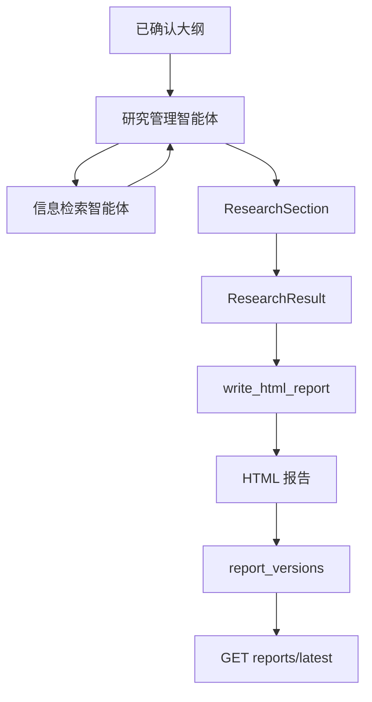
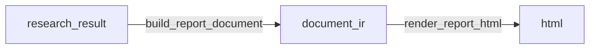

# 报告生成与系统串联

前三章已经完成了项目骨架、异步任务、数据存储、Agent 和工具扩展。到这一章，需要把完整链路串起来：

```text
创建研究项目
  -> 生成研究任务书和大纲
  -> 用户确认大纲
  -> 执行研究
  -> 保存结构化研究结果
  -> 确定性渲染 HTML 报告
  -> 保存报告版本
  -> 查询和查看报告
```

这一章的核心不是继续增加新的 Agent，而是明确研究结果和报告之间的边界：Agent 负责完成研究内容，确定性代码负责把研究内容渲染成报告。

## 1. 报告生成总体设计

### 1.1 为什么报告阶段不再使用报告智能体

在深度研究项目中，报告生成很容易被设计成“再调用一个 LLM，让它把所有资料写成报告”。这种方式实现简单，但会带来几个问题：

1. 报告阶段可能新增事实，导致来源和证据链断裂。

2. 报告阶段可能改写主研究智能体已经形成的结论，导致前后不一致。

3. HTML、目录、引用、样式这些工作并不需要 LLM 推理。

4. 如果报告由 LLM 自由生成，后端很难稳定控制结构和版本。

因此，本项目采用如下设计：

| 阶段 | 执行者 | 职责 |
| --- | --- | --- |
| 研究阶段 | 研究管理智能体 | 写章节正文、整理事实、形成洞察、构建证据链 |
| 检索阶段 | 信息检索智能体 | 搜索资料、读取网页、检索知识库、整理来源 |
| 渲染阶段 | `write_html_report` | 把结构化研究结果渲染为 HTML |
| 保存阶段 | `report_repository` | 保存报告版本和 HTML 存储地址 |

报告阶段不新增研究内容，只做展示转换。

整体流程如下：



### 1.2 研究结果和报告的边界

研究结果是报告渲染的输入。当前项目中，研究结果的核心结构是 `ResearchResult`：

```python
class ResearchResult(BaseModel):
    title: str
    executive_summary: str | None = None
    sections: list[ResearchSection] = Field(default_factory=list)
    sources: list[ReportSource] = Field(default_factory=list)
    fact_cards: list[FactCard] = Field(default_factory=list)
    insight_cards: list[InsightCard] = Field(default_factory=list)
    synthesis: ResearchSynthesis | None = None
```

其中，`sections` 是报告正文的主要来源；`sources` 是引用来源列表；`fact_cards` 和 `insight_cards` 用于支撑报告可信度和后续扩展。

单个章节结构如下：

```python
class ResearchSection(BaseModel):
    section_id: str
    title: str
    summary: str | None = None
    body: str
    key_findings: list[str] = Field(default_factory=list)
    evidence_chain: list[EvidenceItem] = Field(default_factory=list)
    sources: list[ReportSource] = Field(default_factory=list)
    tables: list[dict[str, Any]] = Field(default_factory=list)
    charts: list[dict[str, Any]] = Field(default_factory=list)
    risks: list[str] = Field(default_factory=list)
```

这个结构把报告内容拆成几个稳定部分：

| 字段 | 作用 |
| --- | --- |
| `section_id` | 对应大纲节点，用于保持章节顺序和定位 |
| `title` | 章节标题 |
| `summary` | 章节摘要 |
| `body` | 完整章节正文 |
| `key_findings` | 关键发现，适合在报告中突出展示 |
| `evidence_chain` | 证据链，说明关键判断来自哪些事实和来源 |
| `sources` | 本章节引用的来源详情 |
| `tables` | 可渲染的表格数据 |
| `charts` | 可渲染或占位展示的图表数据 |
| `risks` | 本章节不确定性、口径差异和风险说明 |

### 1.3 来源、事实和洞察的关系

报告可信度来自三个层次：

```text
来源 source
  -> 事实 fact
  -> 洞察 insight
  -> 报告结论
```

来源是网页、政策文件、行业报告或内部知识库片段。事实是从来源中提取出来的可复核陈述。洞察是基于一个或多个事实形成的判断。

事实卡片结构如下：

```python
class FactCard(BaseModel):
    fact_id: str
    statement: str
    source_ids: list[str] = Field(default_factory=list)
    confidence: str = "medium"
```

洞察卡片结构如下：

```python
class InsightCard(BaseModel):
    insight_id: str
    title: str
    summary: str
    supporting_fact_ids: list[str] = Field(default_factory=list)
```

证据链结构如下：

```python
class EvidenceItem(BaseModel):
    claim: str
    fact_ids: list[str] = Field(default_factory=list)
    source_ids: list[str] = Field(default_factory=list)
    confidence: str = "medium"
```

这三个结构组合起来，可以表达一个结论是怎么来的：

```json
{
  "claim": "行业增长主要由政策推动和供应链成熟共同驱动",
  "fact_ids": ["fact-1", "fact-2"],
  "source_ids": ["source-1", "source-2"],
  "confidence": "medium"
}
```

报告渲染阶段只展示这些关系，不重新发明这些关系。

## 2. 确定性报告渲染

### 2.1 `write_html_report` 的职责

`write_html_report` 是最终报告渲染入口。它接收 `research_result`，输出 `title`、`html` 和 `sources`。

核心代码如下：

```python
async def write_html_report(
    research_result: dict[str, Any] | None = None,
    layout_plan: dict[str, Any] | None = None,
    **legacy_kwargs: Any,
) -> dict[str, Any]:
    """最终报告渲染入口。

    输入为主研究 agent 产出的完整 research_result；输出为 title/html/sources。
    该工具只做展示转换和 HTML 渲染，不重写章节正文、不新增事实或来源。
    """

    if research_result is None:
        research_result = _build_research_result_from_legacy_kwargs(legacy_kwargs)
    document_ir = await build_report_document(
        research_result=research_result,
        layout_plan=layout_plan,
    )
    return await render_report_html(document_ir=document_ir)
```

它内部拆成两步：

1. `build_report_document`：把研究结果转换成展示用的 document IR。

2. `render_report_html`：把 document IR 渲染成完整 HTML。



### 2.2 报告渲染工具的能力边界

报告渲染工具支持的能力包括：

| 能力 | 说明 |
| --- | --- |
| 渲染标题和摘要 | 展示报告标题、副标题和摘要 |
| 生成目录 | 根据章节列表生成目录 |
| 渲染章节正文 | 把 `section.body` 转成 HTML |
| 展示关键发现 | 渲染 `key_findings` |
| 展示证据链 | 渲染 `evidence_chain` |
| 展示表格 | 渲染 `tables` |
| 展示图表占位 | 渲染 `charts` 的占位结构 |
| 展示风险说明 | 渲染 `risks` |
| 展示参考来源 | 渲染 `sources` |

报告渲染工具明确不做以下事情：

| 不做什么 | 原因 |
| --- | --- |
| 不新增事实 | 事实必须来自研究阶段 |
| 不新增来源 | 来源必须来自检索阶段 |
| 不新增结论 | 结论必须来自研究阶段 |
| 不改写证据链 | 防止引用关系断裂 |
| 不调用搜索工具 | 搜索属于研究阶段 |
| 不调用 LLM Agent | 渲染是确定性流程 |

`get_report_render_schema` 中对这个边界有明确描述：

```python
async def get_report_render_schema() -> dict[str, Any]:
    return {
        "purpose": "把主研究 agent 已完成的研究结果转换为可展示 HTML",
        "content_boundary": {
            "allowed": [
                "调整版式",
                "生成目录",
                "渲染引用脚注",
                "渲染表格",
                "渲染图表占位",
                "生成参考来源列表",
            ],
            "forbidden": [
                "新增事实",
                "新增来源",
                "新增结论",
                "改写证据链",
                "调用搜索工具",
            ],
        },
    }
```

### 2.3 从研究结果到 HTML

`build_report_document` 负责把研究结果转成展示结构：

```python
async def build_report_document(
    research_result: dict[str, Any],
    layout_plan: dict[str, Any] | None = None,
) -> dict[str, Any]:
    normalized_result = _normalize_research_result(research_result)
    layout = _normalize_layout_plan(layout_plan)
    document_ir = {
        "version": "deep-research-report-ir/v1",
        "title": normalized_result["title"],
        "subtitle": layout.get("subtitle"),
        "theme": layout.get("theme", "professional"),
        "executive_summary": normalized_result.get("executive_summary"),
        "sections": normalized_result["sections"],
        "sources": normalized_result["sources"],
    }
    return document_ir
```

`render_report_html` 负责渲染完整 HTML：

```python
async def render_report_html(document_ir: dict[str, Any]) -> dict[str, Any]:
    document = _normalize_document_ir(document_ir)
    html = (
        "<!doctype html><html lang=\"zh-CN\"><head>"
        "<meta charset=\"utf-8\">"
        "<meta name=\"viewport\" content=\"width=device-width, initial-scale=1\">"
        f"<title>{escape(document['title'])}</title>"
        f"<style>{_build_css()}</style>"
        "</head><body>"
        "<article class=\"report-paper\">"
        f"{_render_hero(document)}"
        f"{_render_toc(document['sections'])}"
        f"{_render_summary(document)}"
        "<div class=\"report-body\">"
        f"{''.join(_render_section(section) for section in document['sections'])}"
        "</div>"
        f"{_render_references(document['sources'], document['sections'])}"
        "</article>"
        "</body></html>"
    )
    return {
        "title": document["title"],
        "html": html,
        "sources": [_public_source(source) for source in document["sources"]],
    }
```

这里的 HTML 样式和细节不是核心，真正重要的是边界：输入必须是结构化研究结果，输出必须是稳定报告对象。

## 3. 报告任务链路串联

### 3.1 报告生成任务

用户确认大纲后，可以提交报告生成任务：

```http
POST /api/v1/research-projects/{project_id}/report-tasks
```

路由层会先校验项目状态：

```python
project = await _get_project(project_id)
if project["status"] != ProjectStatus.OUTLINE_CONFIRMED:
    raise HTTPException(
        status_code=status.HTTP_409_CONFLICT,
        detail="请先确认研究大纲，再提交报告生成任务",
    )
```

校验通过后，系统创建后台任务，并把项目状态更新为 `research_running`：

```python
task = await _create_task(
    project_id=project_id,
    task_type=TaskType.GENERATE_REPORT,
    message=request.user_instruction or "报告生成任务已创建",
)
await research_project_repository.update_project_status(
    project_id=project_id,
    status=ProjectStatus.RESEARCH_RUNNING,
)
start_generate_report_task(
    project_id=project_id,
    task_id=task.task_id,
    user_instruction=request.user_instruction,
)
```

路由层不会等待报告生成完成，只返回任务编号：

```json
{
  "task_id": "任务编号",
  "project_id": "项目编号",
  "task_type": "generate_report",
  "status": "queued"
}
```

### 3.2 后台任务执行流程

报告生成后台任务的核心流程如下：

```python
async def _run_generate_report_task(
    project_id: str,
    task_id: str,
    user_instruction: str | None,
) -> None:
    try:
        await research_task_repository.mark_task_running(
            task_id=task_id,
            message="正在执行研究并生成报告",
        )
        await research_project_repository.update_project_status(
            project_id=project_id,
            status=ProjectStatus.RESEARCH_RUNNING,
        )

        project = await research_project_repository.get_project(project_id=project_id)
        outline = await research_project_repository.get_confirmed_outline(project_id=project_id)
        research_agent = get_research_agent()

        research_result = await research_agent.generate_research_result(
            project=project,
            outline=outline,
            user_instruction=user_instruction,
        )
        await research_project_repository.save_research_result(
            project_id=project_id,
            research_result=research_result,
        )

        project_with_research_result = await research_project_repository.get_project(
            project_id=project_id
        )
        result = await research_agent.generate_report(
            project=project_with_research_result,
            outline=outline,
            user_instruction=user_instruction,
        )
        await report_repository.save_report_version(
            project_id=project_id,
            title=result.title,
            html=result.html,
            sources=result.sources,
        )
```

这段代码体现了报告生成的两个阶段：

| 阶段 | 方法 | 结果 |
| --- | --- | --- |
| 研究执行 | `generate_research_result` | 生成并保存 `research_result` |
| 报告渲染 | `generate_report` | 调用 `write_html_report` 生成 HTML |

最后，后台任务会更新项目状态和任务状态：

```python
await research_project_repository.update_project_status(
    project_id=project_id,
    status=ProjectStatus.REPORT_READY,
)
await research_task_repository.mark_task_succeeded(
    task_id=task_id,
    message="研究报告已生成",
)
```

如果发生异常，统一标记任务失败：

```python
except Exception as exc:
    await _mark_task_failed(
        project_id=project_id,
        task_id=task_id,
        message="研究报告生成失败",
        exc=exc,
    )
```

### 3.3 独立报告渲染任务

项目中还提供了一个独立报告渲染接口：

```http
POST /api/v1/research-projects/{project_id}/report-render-tasks
```

它和 `report-tasks` 的区别如下：

| 接口 | 是否重新执行研究 | 使用场景 |
| --- | --- | --- |
| `report-tasks` | 是 | 从已确认大纲开始，执行研究并生成报告 |
| `report-render-tasks` | 否 | 已经有 `research_result`，只重新渲染 HTML |

独立渲染任务会先检查项目是否已有研究结果：

```python
project = await _get_project(project_id)
if not project.get("research_result"):
    raise HTTPException(
        status_code=status.HTTP_409_CONFLICT,
        detail="当前研究项目尚未生成研究结果，无法直接渲染报告",
    )
```

后台执行时，只读取已落库的 `research_result`，不重新触发检索和研究：

```python
project = await research_project_repository.get_project(project_id=project_id)
if not isinstance(project, dict) or not project.get("research_result"):
    raise ValueError("项目缺少已落库的 research_result，无法直接渲染报告")

outline = await research_project_repository.get_confirmed_outline(project_id=project_id)
research_agent = get_research_agent()
result = await research_agent.generate_report(
    project=project,
    outline=outline,
    user_instruction=user_instruction,
)
```

这个接口体现了研究和渲染的解耦：研究结果一旦落库，就可以多次生成不同版本的展示报告。

## 4. 报告版本和存储

### 4.1 为什么报告要保存版本

报告不应该只保存最新的一份。保存版本有几个好处：

1. 同一个研究结果可以重新渲染不同展示版本。

2. 后续可以比较不同时间生成的报告。

3. 任务失败或用户反馈后，可以保留历史结果。

4. 报告 HTML 可能较大，适合和报告元数据分开存储。

当前项目使用 `report_versions` 集合保存报告版本元数据：

| 字段 | 含义 |
| --- | --- |
| `report_id` | 报告版本编号 |
| `project_id` | 所属研究项目 |
| `version` | 版本号 |
| `title` | 报告标题 |
| `html_uri` | HTML 存储地址 |
| `html_path` | 本地存储路径 |
| `html_size` | HTML 文件大小 |
| `sources` | 报告来源列表 |
| `created_at` | 创建时间 |

### 4.2 保存报告版本

保存报告版本的核心代码如下：

```python
async def save_report_version(
    project_id: str,
    title: str,
    html: str,
    sources: list[ReportSource] | list[dict[str, Any]],
) -> LatestReportResponse:
    latest_document = await _get_collection().find_one(
        {"project_id": project_id},
        sort=[("version", -1)],
        projection={"version": 1},
    )
    next_version = int(latest_document["version"]) + 1 if latest_document else 1
    created_at = utc_now()
    report_id = str(uuid4())
    stored_object = await get_report_object_storage().save_html(
        project_id=project_id,
        report_id=report_id,
        version=next_version,
        html=html,
    )
```

这里先查询当前项目的最新版本号，然后计算下一个版本号。

报告 HTML 不直接存进 MongoDB 文档，而是通过对象存储接口保存：

```python
document = report.model_dump(mode="python", exclude={"html"})
document["_id"] = report.report_id
document["html_uri"] = stored_object.uri
document["html_path"] = stored_object.path
document["html_size"] = stored_object.size
await _get_collection().insert_one(document)
```

这样 MongoDB 保存的是报告元数据，HTML 正文保存在本地文件或对象存储中。

### 4.3 本地报告存储

当前项目默认使用本地文件系统保存报告 HTML：

```python
class LocalReportObjectStorage:
    """本地文件系统报告存储。"""

    def __init__(self, root_dir: str) -> None:
        self.root_dir = Path(root_dir)

    async def save_html(
        self,
        project_id: str,
        report_id: str,
        version: int,
        html: str,
    ) -> StoredReportObject:
        relative_path = Path(project_id) / f"v{version}-{report_id}.html"
        target_path = self.root_dir / relative_path
        await asyncio.to_thread(self._write_text, target_path, html)
        return StoredReportObject(
            uri=f"local://{self.root_dir.as_posix()}/{relative_path.as_posix()}",
            path=target_path.as_posix(),
            size=len(html.encode("utf-8")),
        )
```

报告存储实现通过配置选择：

```python
def get_report_object_storage() -> ReportObjectStorage:
    settings: Settings = get_settings()
    if settings.report_storage_backend == "local":
        return LocalReportObjectStorage(root_dir=settings.report_storage_local_dir)
    if settings.report_storage_backend == "minio":
        return MinioReportObjectStorage()
    raise ValueError(f"不支持的报告存储后端: {settings.report_storage_backend}")
```

第一版使用本地文件系统即可。后续如果接入 MinIO 或 S3，只需要替换 `ReportObjectStorage` 实现，不需要改变路由和报告仓储的调用方式。

### 4.4 获取最新报告

用户查看报告时，调用：

```http
GET /api/v1/research-projects/{project_id}/reports/latest
```

路由层代码如下：

```python
@router.get(
    "/research-projects/{project_id}/reports/latest",
    response_model=LatestReportResponse,
    tags=["研究报告"],
)
async def get_latest_report(project_id: str) -> LatestReportResponse:
    await _get_project(project_id)
    report = await report_repository.get_latest_report(project_id=project_id)
    if report is None:
        raise HTTPException(status_code=status.HTTP_404_NOT_FOUND, detail="研究报告不存在")
    return report
```

Repository 读取最新报告时，按版本号倒序取第一条：

```python
async def get_latest_report(project_id: str) -> LatestReportResponse | None:
    document = await _get_collection().find_one(
        {"project_id": project_id},
        sort=[("version", -1)],
    )
    return await _report_from_document(document)
```

如果报告 HTML 存在 `html_uri`，则从对象存储中读取：

```python
async def _load_report_html(document: dict[str, Any]) -> str:
    html_uri = document.get("html_uri")
    if isinstance(html_uri, str) and html_uri.strip():
        return await get_report_object_storage().read_html(uri=html_uri)
    return str(document.get("html") or "")
```

接口最终返回：

```json
{
  "project_id": "项目编号",
  "report_id": "报告编号",
  "version": 1,
  "title": "具身智能行业机会研究报告",
  "html": "<html>报告正文</html>",
  "sources": [
    {
      "source_id": "source-1",
      "title": "来源标题",
      "url": "https://example.com",
      "published_at": "2026-01-01",
      "source_type": "public_web"
    }
  ],
  "created_at": "2026-06-05T08:30:00Z"
}
```

## 5. 端到端验证

### 5.1 主链路验证顺序

系统完整链路可以按下面顺序验证：

```text
健康检查
  -> 创建研究项目
  -> 查询大纲生成任务状态
  -> 获取大纲
  -> 确认大纲
  -> 提交报告生成任务
  -> 查询报告生成任务状态
  -> 获取最新报告
```

### 5.2 健康检查

```bash
curl http://localhost:8000/health
```

预期返回：

```json
{
  "status": "ok"
}
```

### 5.3 创建研究项目

```bash
curl -X POST http://localhost:8000/api/v1/research-projects \
  -H "Content-Type: application/json" \
  -d '{
    "topic": "研究具身智能行业未来三年的机会",
    "research_goal": "判断公司是否需要关注该行业",
    "target_audience": "公司战略团队",
    "region_scope": "china",
    "time_scope": {
      "type": "recent_years",
      "years": 3
    }
  }'
```

返回中需要记录两个字段：

```json
{
  "project_id": "项目编号",
  "initial_task_id": "任务编号"
}
```

### 5.4 查询任务状态

```bash
curl http://localhost:8000/api/v1/tasks/{task_id}
```

任务执行中：

```json
{
  "status": "running",
  "message": "正在生成研究任务书和大纲"
}
```

任务完成：

```json
{
  "status": "succeeded",
  "message": "研究任务书和大纲已生成，等待用户确认"
}
```

任务失败：

```json
{
  "status": "failed",
  "message": "研究任务书和大纲生成失败: ..."
}
```

### 5.5 获取并确认大纲

获取大纲：

```bash
curl http://localhost:8000/api/v1/research-projects/{project_id}/outline
```

确认大纲：

```bash
curl -X PUT http://localhost:8000/api/v1/research-projects/{project_id}/outline \
  -H "Content-Type: application/json" \
  -d '{
    "action": "confirm"
  }'
```

确认成功后，项目状态变成：

```json
{
  "status": "outline_confirmed",
  "next_step": "generate_report"
}
```

### 5.6 提交报告生成任务

```bash
curl -X POST http://localhost:8000/api/v1/research-projects/{project_id}/report-tasks \
  -H "Content-Type: application/json" \
  -d '{
    "user_instruction": "报告风格偏管理层汇报，结论要明确"
  }'
```

返回：

```json
{
  "task_id": "任务编号",
  "project_id": "项目编号",
  "task_type": "generate_report",
  "status": "queued"
}
```

继续用任务状态接口轮询这个 `task_id`。任务成功后，项目状态会进入 `report_ready`。

### 5.7 获取最新报告

```bash
curl http://localhost:8000/api/v1/research-projects/{project_id}/reports/latest
```

验证重点：

- `html` 字段不为空。

- `version` 从 1 开始递增。

- `sources` 中包含来源列表。

- 报告 HTML 能在浏览器中展示。

## 6. 日志和问题定位

### 6.1 关键日志节点

当前项目使用 `loguru` 记录关键流程日志。几个重要节点包括：

| 节点 | 日志作用 |
| --- | --- |
| 创建项目成功 | 确认路由层已创建项目和初始任务 |
| 后台任务已提交 | 确认 `asyncio.create_task` 已执行 |
| 开始生成研究任务书和大纲 | 确认任务进入 running |
| 研究结果已保存 | 确认 Agent 已产出结构化研究结果 |
| HTML 报告已渲染 | 确认确定性渲染流程完成 |
| 研究和报告渲染完成 | 确认报告版本已保存 |
| 后台任务执行失败 | 定位异常类型和错误摘要 |

后台任务失败时，会统一调用 `_mark_task_failed`：

```python
async def _mark_task_failed(
    project_id: str,
    task_id: str,
    message: str,
    exc: Exception,
) -> None:
    error_message = _build_task_error_message(message=message, exc=exc)
    logger.exception(
        "后台任务执行失败，project_id={}，task_id={}，error={}，exception_detail={}，exception_attrs={}",
        project_id,
        task_id,
        error_message,
        str(exc),
        _extract_exception_attrs(exc),
    )
    await research_task_repository.mark_task_failed(
        task_id=task_id,
        message=error_message,
    )
```

这样，前端可以通过任务状态接口看到失败摘要，后端日志中可以看到更详细的异常信息。

### 6.2 常见问题

| 问题 | 可能原因 | 排查方向 |
| --- | --- | --- |
| 创建项目后一直没有大纲 | 后台任务没有启动，或 Agent 调用失败 | 查看任务状态和后台日志 |
| 报告任务提交返回 409 | 大纲还没有确认 | 先调用大纲确认接口 |
| 报告渲染失败 | `research_result` 缺失或结构不完整 | 检查项目文档中的 `research_result` |
| 报告来源为空 | 研究阶段没有保存来源 | 检查章节 `sources` 和证据链 |
| 最新报告返回 404 | 尚未成功保存报告版本 | 查询报告任务状态 |
| HTML 文件读不到 | `html_uri` 或本地存储路径异常 | 检查 `report_storage_local_dir` 和文件路径 |

## 7. 系统复盘和扩展方向

### 7.1 当前系统已经具备的能力

完成报告生成和链路串联后，系统已经具备一个 AI 研究报告工作台的主干能力：

| 能力 | 说明 |
| --- | --- |
| 产品流程 | 从研究主题到报告生成的完整链路 |
| 接口入口 | FastAPI 提供项目、大纲、任务、报告接口 |
| 异步任务 | 长耗时研究任务在后台执行 |
| 状态追踪 | 项目状态和任务状态可查询 |
| 数据沉淀 | MongoDB 保存项目、大纲、研究结果和报告版本 |
| Agent 协作 | 研究管理智能体协调信息检索智能体 |
| 工具扩展 | 搜索、网页读取、RAGFlow、章节保存、报告渲染 |
| 报告生成 | 结构化研究结果确定性渲染为 HTML |
| 引用溯源 | 来源、事实、洞察和证据链可追踪 |

### 7.2 第一版系统的边界

第一版系统仍然有明确边界：

- 不做登录和权限。

- 不做团队协作。

- 不做复杂任务队列。

- 不展开前端实现。

- 不展开 RAGFlow、TEI、Docker 部署细节。

- 不把 HTML/CSS 样式作为重点。

- 不构建独立报告写作 Agent。

这些边界不是缺陷，而是为了让第一版主链路保持清晰。

### 7.3 后续扩展方向

后续可以从以下方向扩展：

| 方向 | 扩展方式 |
| --- | --- |
| 任务系统 | 用 Celery、Dramatiq 或队列服务替换进程内 `asyncio.create_task` |
| 报告存储 | 用 MinIO 或 S3 替换本地文件系统 |
| 权限系统 | 增加用户、团队、项目权限 |
| 数据源 | 增加数据库查询、企业内部 API、文件解析工具 |
| Agent | 增加问数智能体、政策分析智能体、竞品分析智能体 |
| 报告能力 | 增加 PDF 导出、PPT 导出、多版本对比 |
| 可观测性 | 增加 trace、token 统计、工具调用日志、失败重试 |
| 质量控制 | 增加来源评分、事实一致性检查、人工审核节点 |

系统扩展时，核心原则仍然不变：

```text
业务流程先清楚
  -> 状态和数据结构先稳定
  -> Agent 只做适合 LLM 的事情
  -> 工具提供外部能力
  -> 确定性代码负责可控流程
  -> 所有关键结果必须能落库和追溯
```

这条原则适用于当前深度研究项目，也适用于很多企业 AI 应用。
